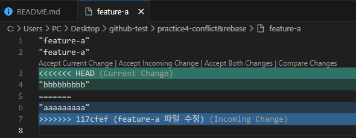
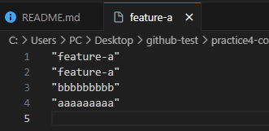
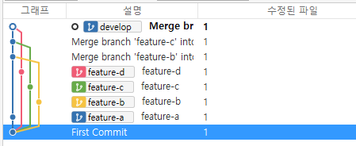
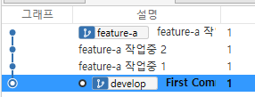
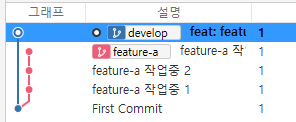

# 1. Git 명령어 예시

 - `1. develop 브랜치 생성`
```bash
### 1. develop 브랜치 생성 및 커밋
git checkout -b develop
echo "test" >> README.md
git add.
git commit -m "First Commit"
```
<br/>

 - `2. Practice1 - 일반 Merge (Fast Forward)`
```bash
### 2. Practice1 - 일반 Merge (Fast Forward)
# 2-1. feature-a 생성
git checkout -b feature-a
echo "feature-a" >> feature-a
git add .
git commit -m "feature-a 작업"

# 2-2. develop 병합
git checkout develop
git merge feature-a
```
<br/>

 - `3. Practice2 - Merge Commit`
```bash
### 3. Practice2 - 일반 Merge (Merge Commit)
# 3-1. feature-b 커밋 생성
git checkout develop
git checkout -b feature-b
echo "feature-b" >> feature-b
git add .
git commit -m "feature-b 작업"

# 3-2. feature-a 커밋 생성
git checkout feature-a
echo "feature-a" >> feature-a
git add .
git commit -m "feature-a 수정"

# 3-3. develop 브랜치에 feature-b 병합
git checkout develop
git merge feature-b
$ git log --oneline --graph --decorate --all

* 40f48ea (HEAD -> develop, feature-b) feature-b
| * db22987 (feature-a) feature-a 수정
|/
* cd2398a feature-a 작업
* e4cb73f First Commit

# 3-4. feature-a 병합 (Merge Commit)
git merge feature-a

$ git log --oneline --graph --decorate --all
*   34d12f6 (HEAD -> develop) Merge branch 'feature-a' into develop
|\
| * db22987 (feature-a) feature-a 수정
* | 40f48ea (feature-b) feature-b
|/
* cd2398a feature-a 작업
* e4cb73f First Commit
```
<br/>

 - `4. Parctice3 - 리베이스 + 머지`
```bash
### 4. Practice3 - 리베이스 + 머지
# 4-1. develop에 feature-b 커밋, feature-a에 feature-a 커밋 상황 되돌리기
git reset --hard 40f48ea

# 4-2. feature-a 브랜치에 develop 브랜치 커밋을 리베이스
git checkout feature-a
git rebase develop

$ git log --oneline --graph --decorate --all
* 386338b (HEAD -> feature-a) feature-a 수정
* 40f48ea (feature-b, develop) feature-b
* cd2398a feature-a 작업
* e4cb73f First Commit

# 4-3. develop 브랜치에 feature-a 커밋 병합
git checkout develop
git merge feature-a

$ git log --oneline --graph --decorate --all
* 386338b (HEAD -> develop, feature-a) feature-a 수정
* 40f48ea (feature-b) feature-b
* cd2398a feature-a 작업
* e4cb73f First Commit
```
<br/>

 - `5. Practice4 - 리베이스 충돌 해결`
```bash
### 5. 리베이스 충돌 해결
# 5-1. feature-a가 feature-a 파일 수정 후 커밋
git checkout feature-a
echo "aaaaaaaaa" >> feature-a
git add .
git commit -m "feature-a 파일 수정"

# 5-2. feature-b가 feature-a 파일 수정 후 커밋
git checkout feature-b
git merge develop
echo "bbbbbbbbb" >> feature-a
git add .
git commit -m "feature-b 브랜치가 feature-a 파일 수정"

$ git log --oneline --graph --decorate --all
* 50215ec (HEAD -> feature-b) feature-b 브랜치가 feature-a 파일 수정
| * 117cfef (feature-a) feature-a 파일 수정
|/
* 386338b (develop) feature-a 수정
* 40f48ea feature-b
* cd2398a feature-a 작업
* e4cb73f First Commit

# 5-3. develop 브랜치에 feature-b 병합
git checkout develop
git merge feature-b

$ git log --oneline --graph --decorate --all
* 50215ec (HEAD -> develop, feature-b) feature-b 브랜치가 feature-a 파일 수정
| * 117cfef (feature-a) feature-a 파일 수정
|/
* 386338b feature-a 수정
* 40f48ea feature-b
* cd2398a feature-a 작업
* e4cb73f First Commit

# 5-4. feature-a에 develop 커밋 리베이스 (충돌 발생)
git checkout feature-a
git rebase develop

error: could not apply 117cfef... feature-a 파일 수정
Resolve all conflicts manually, mark them as resolved with
"git add/rm <conflicted_files>", then run "git rebase --continue".
You can instead skip this commit: run "git rebase --skip".
To abort and get back to the state before "git rebase", run "git rebase --abort".
Could not apply 117cfef... feature-a 파일 수정
Auto-merging feature-a
CONFLICT (content): Merge conflict in feature-a

# 5-5. 충돌 해결
# feature-a 파일 수정
git add .
git rebase --contiue

$ git log --oneline --graph --decorate --all
* 49edc55 (HEAD -> feature-a) feature-a 파일 수정
* 50215ec (feature-b, develop) feature-b 브랜치가 feature-a 파일 수정
* 386338b feature-a 수정
* 40f48ea feature-b
* cd2398a feature-a 작업
* e4cb73f First Commit

# 5-6. develop 브랜치에 머지
git checkout develop
git merge feature-a

$ git log --oneline --graph --decorate --all
* 49edc55 (HEAD -> develop, feature-a) feature-a 파일 수정
* 50215ec (feature-b) feature-b 브랜치가 feature-a 파일 수정
* 386338b feature-a 수정
* 40f48ea feature-b
* cd2398a feature-a 작업
* e4cb73f First Commit
```

<div align="center">
    <br/>
    
</div>
<br/>


 - `99. 부록 - 다중 Merge Commit`
```bash
# develop
git init
git checkout -b develop
git echo "README" >> README.md
git add .
git commit -m "First Commit"
git branch feature-a
git branch feature-b
git branch feature-c
git branch feature-d

# feature-a
git checkout feature-a
echo "feature-a" >> feature-a
git add .
git commit -m "feature-a"

# feature-b
git checkout feature-b
echo "feature-b" >> feature-b
git add .
git commit -m "feature-b"

# feature-c
git checkout feature-c
echo "feature-c" >> feature-c
git add .
git commit -m "feature-c"

# feature-d
git checkout feature-d
echo "feature-d" >> feature-d
git add .
git commit -m "feature-d"

# 이력 확인
git checkout develop
$ git log --oneline --graph --decorate --all
* 2db4607 (feature-d) feature-d
| * 0fb2d6c (feature-c) feature-c
|/
| * 96aa51a (feature-b) feature-b
|/
| * d589b96 (feature-a) feature-a
|/
* f87adec (HEAD -> develop) First Commit

# feature-a 병합
git merge feature-a

$ git log --oneline --graph --decorate --all
* 2db4607 (feature-d) feature-d
| * 0fb2d6c (feature-c) feature-c
|/
| * 96aa51a (feature-b) feature-b
|/
| * d589b96 (HEAD -> develop, feature-a) feature-a
|/
* f87adec First Commit

# feature-b 병합
git merge feeature-b

$ git log --oneline --graph --decorate --all
*   8c087c2 (HEAD -> develop) Merge branch 'feature-b' into develop
|\
| * 96aa51a (feature-b) feature-b
* | d589b96 (feature-a) feature-a
|/
| * 2db4607 (feature-d) feature-d
|/
| * 0fb2d6c (feature-c) feature-c
|/
* f87adec First Commit

# feature-c 병합
git merge feature-c

$ git log --oneline --graph --decorate --all
*   406265f (HEAD -> develop) Merge branch 'feature-c' into develop
|\
| * 0fb2d6c (feature-c) feature-c
* |   8c087c2 Merge branch 'feature-b' into develop
|\ \
| * | 96aa51a (feature-b) feature-b
| |/
* / d589b96 (feature-a) feature-a
|/
| * 2db4607 (feature-d) feature-d
|/
* f87adec First Commit

# feature-d 병합
git merge feature-d

$ git log --oneline --graph --decorate --all
*   74d01fb (HEAD -> develop) Merge branch 'feature-d' into develop
|\
| * 2db4607 (feature-d) feature-d
* |   406265f Merge branch 'feature-c' into develop
|\ \
| * | 0fb2d6c (feature-c) feature-c
| |/
* |   8c087c2 Merge branch 'feature-b' into develop
|\ \
| * | 96aa51a (feature-b) feature-b
| |/
* / d589b96 (feature-a) feature-a
|/
* f87adec First Commit
```
<div align="center">
    
</div>
<br/>

 - `99. 부록 - 스쿼시 머지`
```bash
# develop
git init
git checkout -b develop
git echo "README" >> README.md
git add .
git commit -m "First Commit"

# feature-a 브랜치에 여러 커밋 생성
git checkout -b feature-a

echo "feature-a" >> feature-a
git add .
git commit -m "feature-a 작업중 1"

echo "feature-a" >> feature-a
git add .
git commit -m "feature-a 작업중 2"

echo "feature-a" >> feature-a
git add .
git commit -m "feature-a 작업중 3"

# 이력 확인
$ git log --oneline --graph --decorate --all
* e7e1447 (HEAD -> feature-a) feature-a 작업중 3
* c7fb0e1 feature-a 작업중 2
* b6ebdee feature-a 작업중 1
* bf333da (develop) First Commit

# develop 브랜치로 스쿼시 머지
git checkout develop
git merge --squash feature-a

$ git status
On branch develop
Changes to be committed:
  (use "git restore --staged <file>..." to unstage)
        new file:   feature-a

$ git commit -m "feat: feature-a 작업"

# 이력 확인
$ git log --oneline --graph --decorate --all

* 0f7d278 (HEAD -> develop) feat: feature-a 작업
| * e7e1447 (feature-a) feature-a 작업중 3
| * c7fb0e1 feature-a 작업중 2
| * b6ebdee feature-a 작업중 1
|/
* bf333da First Commit
```

<div align="center">
    <br/>
    
</div>
<br/>

# 2. SourceTree 사용법

 - 신규 깃 정보 생성: Create
    - 초기에 CLI로 브랜치를 만들어 주어야 함. 최초 1회 커밋 이후 GUI로 작업.
 - 로컬 깃 정보로 로드: Add
 - 원격 깃 정보로 로드: Clone