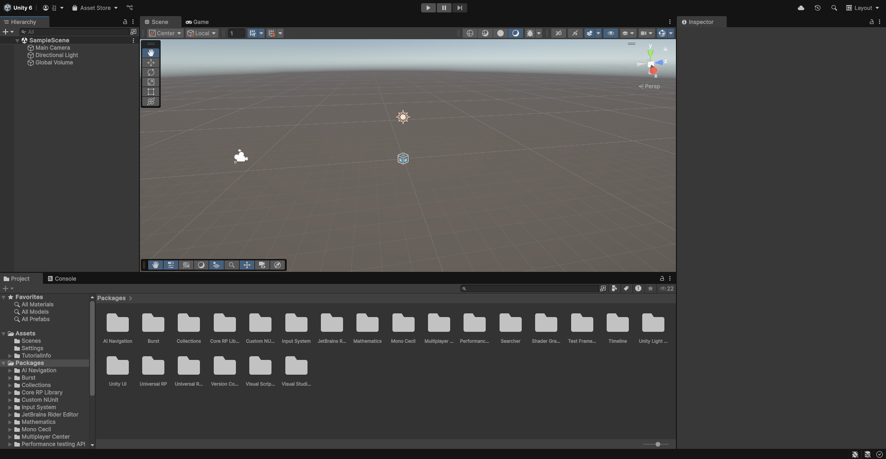
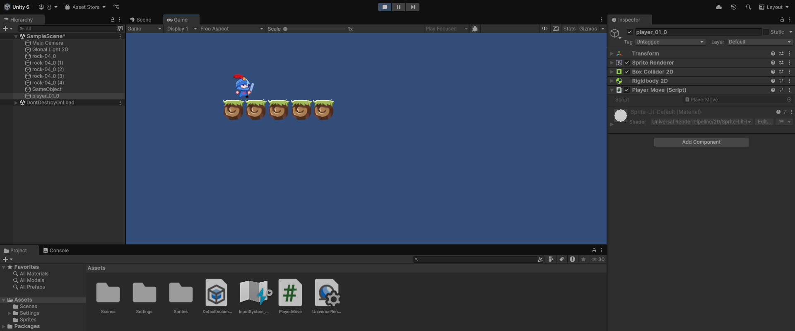
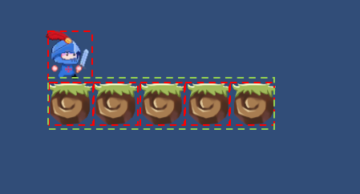
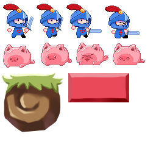
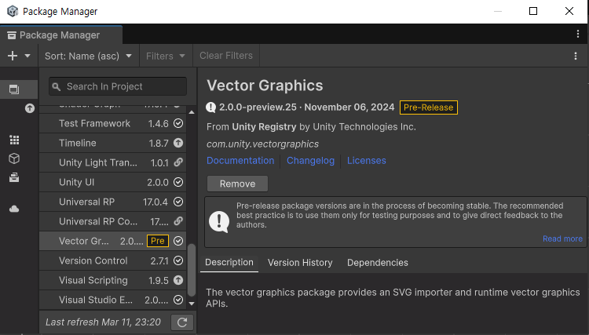

# 1. 유니티 개발자가 되기 위한 첫걸음

유니티(Unity)는 멀티플랫폼 게임 엔진으로, 2D 및 3D 게임 개발을 비롯해 VR/AR, 시뮬레이션, 애니메이션, 건축 시각화 등 다양한 분야에서 사용됩니다.

 - __멀티플랫폼 지원__
    - 한 번 개발한 게임을 여러 플랫폼(PC, 콘솔, 모바일, 웹, VR/AR 등)에서 실행할 수 있도록 지원합니다.
    - 지원하는 플랫폼: Windows, macOS, Linux, Android, iOS, PlayStation, Xbox, Nintendo Switch, WebGL 등
 - __쉬운 개발 환경__
    - 비주얼 에디터: 직관적인 UI로 오브젝트 배치, 애니메이션, UI 제작 등이 용이합니다.
    - C# 프로그래밍: C#을 사용하여 게임 로직을 작성합니다.
    - 빠른 프로토타이핑: 즉각적인 변경 사항을 확인할 수 있어 개발 속도가 빠릅니다.
 - __강력한 2D/3D 지원__
    - 2D/3D 게임 개발이 모두 가능하며, 피직스(Physics) 엔진이 내장되어 있습니다.
    - 애니메이션, 조명, 셰이더, 포스트 프로세싱 등의 그래픽 기능이 포함되어 있습니다.
 - __에셋 스토어(Unity Asset Store)__
    - 3D 모델, 사운드, 애니메이션, 스크립트, 플러그인 등 다양한 리소스를 무료/유료로 구매하여 사용할 수 있습니다.

# 2. 유니티 프로젝트 생성 및 에디터 화면 구성

 - Scene
    - 게임에 사용되는 모든 오브젝트를 배치하기 위한 화면
    - 카메라, UI, 게임 오브젝트를 비롯한 모든 구성요소 배치
 - Game
    - Scene에서 만든 화면이 실행시켰을 때의 모습
    - 최종 사용자에게 보여지는 게임 화면
 - Project
    - 현재 프로젝트가 저장된 폴더 내용
    - Scene, C# 스크립트, 스프라이트, 3D 모델링, 이미지, 사운드 등이 포함
 - Hierarchy
    - 현재 Scene에 존재하는 모든 게임 오브젝트 확인
    - 카메라를 비롯해 모든 UI 요소와 조명, 배경과 캐릭터를 포함한 모든 게임 오브젝트
 - Inspector
    - 하나의 오브젝트의 상태를 지정

<div align="center">
    
</div>
<br/>

# 3. 게임 오브젝트 사용하기

 - 오브젝트 생성 및 회전하기
    - 오브젝트 생성: Hierarchy > 우클릭 > 3D object > Cube
    - 회전 스크립트 만들기: Project > Assets > 우클릭 > Create > Sqcripting > MonoBehaviour Script
    - 스크립트 적용하기: 오브젝트 클릭 > Inspector > Add Component > Script > *.cs 파일 선택
    - 스크립트 적용하기2: cs 파일을 오브젝트에 드래그앤 드랍
```c#
using UnityEngine;

public class Player : MonoBehaviour
{
    // Start is called once before the first execution of Update after the MonoBehaviour is created
    void Start()
    {
        
    }

    // Update is called once per frame
    void Update()
    {
        // 1초에 100도 회전
        transform.Rotate(new Vector3(0, Time.deltaTime * 100.0f, 0));
    }
}
```

# 4. 유니티를 이용한 기초적인 2D 게임의 개발

## 프로젝트 생성 및 스프라이트

스프라이트란 게임에서 사용되는 사각형 이미지를 말하며 캐릭터, 배경, 효과 및 UI 등에 다양하게 사용된다.

 - 프로젝트 생성
    - Universal 2D > Lesson02
 - 스프라이트 폴더 생성
    - 깃허브: https://github.com/proonan29/LearnUnity01
    - 깃허브의 Ch05 폴더에서 Sprites 이용
    - Assets > Sprites를 만들고 옮기기

## 캐릭터 이동 및 점프

 - 바닥 오브젝트 배치
    - 바위 5개
 - 바닥 오브젝트 배치
    - 충돌 체크를 담당하는 2차원 콜라이더 오브젝트 생성
    - Create Empty 생성
    - Add Component: Physics 2D > Box Collider 2D
    - 바닥 사이즈(바위 5개) 만큼 너비를 변경
 - 주인공 오브젝트 배치
    - 주인공 1개
    - 2D 충돌 체크
        - Add Component: Physics 2D > Box Collider 2D
    - 중력 및 리지드바디 2D 적용
        - Add Component: Physics 2D > Rigidbody 2D
    - 점프 및 이동 적용
        - Assets/Script/PlayerMove 파일 생성(Create > MonoBehaviour Script)
        - Add Component: Script > PlayerMove.cs

```c#
using UnityEngine;

public class PlayerMove : MonoBehaviour
{
    const float SPEED_JUMP = 5.0f;
    const float SPEED_MOVE = 3.0f;

    Rigidbody2D rb;
    bool leftPressed = false;
    bool rightPressed = false;
    
    // 게임 오브젝트가 처음 생성되었을 때 1번만 호출
    // 오브젝트가 리지드바디를 가지고 있으면 rb 변수에 초기화
    void Start()
    {
        rb = GetComponent<Rigidbody2D>();
    }

    // 매 프레임마다 호출되는 가상 함수
    void Update()
    {
        if (rb != null)
        {
            float dist = SPEED_MOVE * Time.deltaTime; // 거리(S) = 속도(v) * 시간(t)
            Vector2 pos = transform.position;
            // 왼쪽 이동
            if (Input.GetKeyDown(KeyCode.LeftArrow))
            {
                leftPressed = true;
            }
            if (Input.GetKeyUp(KeyCode.LeftArrow))
            {
                leftPressed = false;
            }
            if (leftPressed)
            {
                pos.x -= dist;
            }
            
            // 오른쪽 이동
            if (Input.GetKeyDown(KeyCode.RightArrow))
            {
                rightPressed = true;
            }
            if (Input.GetKeyUp(KeyCode.RightArrow))
            {
                rightPressed = false;
            }
            if (rightPressed)
            {
                pos.x += dist;
            }
            transform.position = pos;

            // 점프
            if (Input.GetKeyDown(KeyCode.UpArrow))
            {
                Vector2 moveVelocity = rb.linearVelocity;
                moveVelocity.y = SPEED_JUMP;
                rb.linearVelocity = moveVelocity;
            }
        }
    }
}
```

<div align="center">
    <br/>
    
</div>

# 5. 사용자 입력 처리

Unity에서는 사용자의 입력(키보드, 마우스, 터치, 컨트롤러 등)을 감지하고 이를 활용하여 캐릭터를 움직이거나 UI를 조작할 수 있습니다.

주로 Input 클래스를 사용하여 입력을 감지하고 처리합니다.

## 키보드 입력 감지

 - __Input.GetKey(KeyCode.X)__: X 키가 눌려있는 동안
 - __Input.GetKeyDown(KeyCode.X)__: X 키가 눌렸을 때 한 번만
 - __Input.GetKeyUp(KeyCode.X)__: X 키가 떨어질 때 한 번만

```c#
void Update()
{
    if (Input.GetKeyDown(KeyCode.Space)) // Space 키가 눌리면
    {
        Debug.Log("Space 키가 눌렸습니다!");
    }

    if (Input.GetKey(KeyCode.W)) // W 키가 계속 눌려 있으면
    {
        Debug.Log("W 키가 계속 눌려 있음");
    }

    if (Input.GetKeyUp(KeyCode.W)) // W 키에서 손을 떼면
    {
        Debug.Log("W 키에서 손을 뗐습니다!");
    }
}
```

## 조이스틱 입력 감지

조이승틱이나 조이패드를 연결할 수 있는 디바이스라면 Input 클래스의 함수를 이용하여 각종 정보를 알아낼 수 있습니다.

 - __Input.GetAxis("Horizontal")__: A(←) 또는 D(→) 키, 방향키(← →) 또는 조이스틱 좌우 이동 감지
 - __Input.GetAxis("Vertical")__: W(↑) 또는 S(↓) 키, 방향키(↑ ↓) 또는 조이스틱 상하 이동 감지
```c#
void Update()
{
    float moveX = Input.GetAxis("Horizontal"); // 좌우 이동 값 (-1 ~ 1)
    float moveY = Input.GetAxis("Vertical");   // 상하 이동 값 (-1 ~ 1)

    Debug.Log("X 이동: " + moveX + " / Y 이동: " + moveY);
}
```

## 마우스 입력 감지

 - 0은 왼쪽 버튼, 1은 오른쪽 버튼
 - __Input.GetMouseButton(0)__: 마우스 왼쪽 버튼이 눌린 상태
 - __Input.GetMouseButtonDown(0)__: 마우스 왼쪽 버튼이 딱 한 번 눌림
 - __Input.GetMouseButtonUp(0)__: 마우스 왼쪽 버튼에서 손을 뗄 때
 - __Input.mousePosition__: 마우스의 화면 내 위치 (Vector3)

```c#
void Update()
{
    Vector3 mousePos = Input.mousePosition;
    Debug.Log("마우스 위치: " + mousePos);

    if (Input.GetMouseButtonDown(0)) // 마우스 왼쪽 버튼 클릭
    {
        Debug.Log("마우스 왼쪽 버튼 클릭!");
    }

    if (Input.GetMouseButtonDown(1)) // 마우스 오른쪽 버튼 클릭
    {
        Debug.Log("마우스 오른쪽 버튼 클릭!");
    }
}
```

## 이전 프로젝트 마우스 우클릭시 순간이동

```c#
using UnityEngine;

public class PlayerMove : MonoBehaviour
{
    const float SPEED_JUMP = 5.0f;
    const float SPEED_MOVE = 3.0f;

    Rigidbody2D rb;
    bool leftPressed = false;
    bool rightPressed = false;
    
    void Start()
    {
        rb = GetComponent<Rigidbody2D>();
    }

    void Update()
    {
        if (rb != null)
        {
            float dist = SPEED_MOVE * Time.deltaTime;
            Vector2 pos = transform.position;
            // 왼쪽 이동
            if (Input.GetKeyDown(KeyCode.LeftArrow))
            {
                leftPressed = true;
            }
            if (Input.GetKeyUp(KeyCode.LeftArrow))
            {
                leftPressed = false;
            }
            if (leftPressed)
            {
                pos.x -= dist;
            }
            
            // 오른쪽 이동
            if (Input.GetKeyDown(KeyCode.RightArrow))
            {
                rightPressed = true;
            }
            if (Input.GetKeyUp(KeyCode.RightArrow))
            {
                rightPressed = false;
            }
            if (rightPressed)
            {
                pos.x += dist;
            }
            transform.position = pos;

            // 점프
            if (Input.GetKeyDown(KeyCode.UpArrow))
            {
                Vector2 moveVelocity = rb.linearVelocity;
                moveVelocity.y = SPEED_JUMP;
                rb.linearVelocity = moveVelocity;
            }
            
            // 마우스 우클릭
            if (Input.GetMouseButtonDown(1))
            {
                Vector3 newPos = Camera.main.ScreenToWorldPoint(Input.mousePosition);
                transform.position = newPos;
                rb.linearVelocity = Vector2.zero;
            }
        }
    }
}
```

# 6. 다양한 스프라이트 사용법

## 래스터 이미지

게임 제작시 사용되는 이미지는 벡터(vector) 방식과 래스터(raster) 방식이 존재한다. 래스터 방식은 픽셀(pixel) 단위의 사각형으로 이루어진 이미지고, 벡터 그래픽은 패스(path) 라는 개념을 사용한 것으로 선, 곡선, 도형 등을 이용해 이미지를 구성한다.

 - 유니티에서는 그래픽 자원으로 래스터 방식의 이미지를 주로 사용한다.
 - PNG, JPG, BMP, TIF, TGA 등 지원
 - GIF는 미지원
 - 투명도가 필요한 이미지는 PNG, 투명도가 필요없는 이미지는 JPG를 사용한다. JPG 파일은 압축도는 높지만 원본 이미지에서 어느 정도의 손실이 발생하며 투명도를 지원하지 않는다.

## 스프라이트 에디터

 - Unity 6 이전 버전에서는 2D Sprite를 설치해주어야 한다. Unity 6에서는 기본적으로 설치되어 있음
    - Window > Package Manager > 2D Sprite

## 스프라이트 시트

여러 개의 스프라이트를 한 개의 파일로 모은 것을 스프라이트 시트라고 한다.

 - __사용의 편리성__: 스프라이트가 각각의 파일로 존재하지 않기 때문에 파일 관리가 용이
 - __저장 공간 절약__: 하나의 파일로 합쳐 일반적으로 파일 공간을 줄일 수 있다.
 - __메모리 절약__: 하나의 스프라이트 파일로 만들어 한 번에 로딩할 수 있으며, 파일 크기가 줄어드는 만큼 메모리 공간을 절약할 수 있다.

<div align="center">
    
</div>
<br/>

## 벡터 이미지 사용하기

유니티에서는 벡터 방식의 이미지 역시 지원한다. 단지 아직 정식 패키지로 출시되지 않은 Preview 상태이다.
 - Window > Package Manager > + 버튼 > Add package from git URL
 - com.unity.vectorgraphics 입력

<div align="center">
    
</div>
