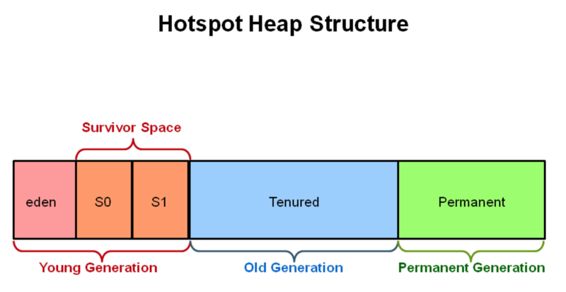
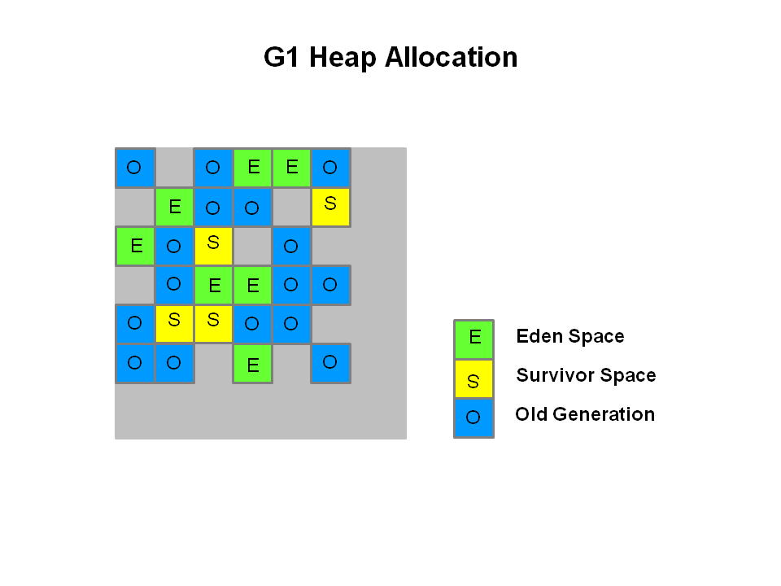
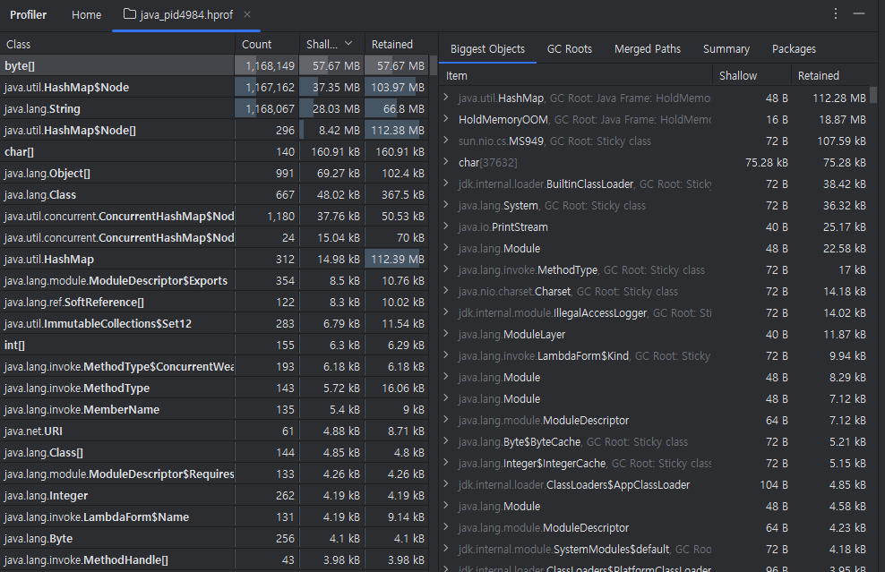

# 메모리 진단하기

## 1. 메모리 때문에 발생할 수 있는 문제들

### 1-1. 자바의 메모리 영역

 - __pc 레지스터__
    - 스레드별 보유
    - 각 스레드의 JVM 인스트럭션의 주소가 저장되어 있다.
    - __각 쓰레드마다 별도로 할당되며, 현재 실행 중인 JVM 명령의 주소를 저장한다.__
    - __CPU가 다음에 실행할 명령어의 위치를 추적하기 위한 용도로 사용된다.__
 - __JVM 스택__
    - 스레드별 보유
    - 스레드가 생성되면서 동시에 생성된다. 이 영역에는 지역 변수와 부분 결과를 저장하며, 메서드 호출 및 리턴과 관련된 정보가 보관된다.
    - __각 쓰레드마다 할당되는 메모리 영역으로, 메서드 호출 시 생성되는 지역 변수와 메서드 호출 기록(프레임)이 저장된다.__
    - __메서드가 호출될 때마다 스택 프레임(Stack Frame)이 추가되고, 메서드가 종료되면 해당 프레임이 제거된다.__
    - __기본 자료형(int, float, etc.)과 참조 자료형의 참조값이 저장되며, 쓰레드마다 독립적으로 관리되며, 메모리 관리는 자동으로 이루어진다.__
 - __힙__
    - 대부분의 데이터가 저장되는 일반적인 저장소
    - 모든 클래스의 인스턴스와 배열이 할당된다. 이 영역은 JVM이 시작될 때 생성되며 가비지 컬렉터에 의해서 관리된다.
    - __객체와 배열이 동적으로 생성되어 저장되는 영역으로 대부분의 객체가 여기서 생성되며, 가비지 컬렉터(Garbage Collector)에 의해 관리된다.__
 - __메서드 영역__
    - 모든 JVM의 스레드를 공유하며, 각 클래스의 구조 정보를 저장하는 영역
    - 런타임 상수 풀, 필드, 메서드 데이터, 메서드와 생성자의 코드, 클래스와 인터페이스 인스턴스의 초기화를 위한 특수 메서드 들에 대한 정보들이 들어 있다.
    - __클래스 데이터와 상수, 메서드 코드 및 필드가 저장되는 영역으로 JVM이 시작될 때 할당되고, 클래스가 로드될 때마다 그 정보가 이곳에 저장되며, 모든 쓰레드에서 고융된다.__
 - __런타임 상수 풀__
    - 메서드 영역에 할당되어 있음
    - 각각의 클래스 및 인터페이스에 대한 constant_pool 테이블을 실행 시 참고하기 위한 저장소이다. 여기에는 여러 종류의 상수들을 저장한다.
 - __네이티브 메서드 스택__
    - 자바 언어 이외의 네이티브 언어를 호출할 경우 타 언어의 스택 정보를 여기에 저장한다.
    - 자바가 아닌 다른 언어(C, C++ 등)로 작성된 네이티브 메서드가 호출될 때 사용하는 스택이다.
    - __JNI(Java Native Interface)를 통해 호출되는 메서드의 정보를 저장하며, 각 쓰레드마다 독립적으로 할당된다.__

JDK 8 이전 환경에서 일반적으로 개발하는 객체들은 힙 영역에 저장되며, 이 힙 영역은 Eden, Survivor, Tenured, Permanent 영역으로 나뉜다.  
G1 GC 부터는 바둑판 모양으로 메모리 영역이 나뉜다. 이 여러 영역들 중 일부를 New 영역, 나머지를 Old 영역으로 정의해서 사용하는 것이 바로 G1 GC다.  
자바는 GC가 발생하면, 다른 영역으로 데이터를 복사하는 작업을 수행한다. 아무리 메모리가 빠르다고 하더라도 복사하는 작업을 수행하면 성능 저하가 발생할 수 밖에 없다. 그래서 G1 GC에서는 New 영역이 꽉 차서 더 이상 메모리를 할당할 공간이 없다면 자기 자신을 Old 영역으로 변환해 보다 빠른 GC를 제공한다.  

<div align="center">
    <br/>
    
</div>
<br/>

### 1-2. OutOfMemoryError는 언제 발생할까?

OutOfMemoryError의 부모 클래스는 java.lang.Error 클래스가 아니고, java.lang.VirtualMachineError라는 클래스이다. 이 VirtualMachineError 클래스는 abstract 클래스로 장애를 만나더라도 이 클래스에 대한 정보를 볼 일이 없다. 이 클래스는 JVM에 문제가 생겼거나, 작업을 계속해서 진행할 리소스가 부족할 때 발생한다고 API에 나와있다. 이 클래스의 자식 클래스로는 OutOfMemoryError, InternalError, StackOverflowError, UnknownError가 있다.  
 - 가비지 컬렉터가 새로운 객체를 생성할 공간을 더 이상 만들어주지 못하고, 더 이상 힙 영역의 메모리가 증가될 수 없을 때
 - 네이티브 라이브러리 코드에서 스왑 영역이 부족하여, 더 이상 네이티브 할당을 할 수 없을 때

### 1-3. OutOfMemoryError 메시지의 의미

 - __Exception in thread "main".java.lang.OutOfMemoryError: Java heap space__
    - 자바의 힙 영역에 더 이상 객체를 생성하기 어려울 때 이 메시지를 출력한다.
    - 메모리 크기를 너무 적게 잡아 놓거나, 아예 메모리 크기를 지정하지 않은 경우
        - 자바 실행 옵션 중 -Xms는 JVM 메모리의 최소 크기를, -Xmx는 JVM의 최대 메모리 크기를 지정한다.
    - 오래된 객체들이 계속 참조되고 있어서 GC가 되지 않는 경우
        - static을 잘못 사용하는 경우나 애플리케이션이 의도치 않게 객체를 지속해서 참조할 경우 문제가 발생할 수 있다.
    - finalize 메서드를 개발자가 개발한 클래스에 구현해 놓은 경우
        - GC가 발생하기 전에 GC가 되어야 하는 객체들은 큐에 쌓이도록 되어 있다. 때문에, 오라클의 JVM에서는 자바의 GC를 처리하기 위한 데몬 스레드가 존재하며, 이 스레드에서 쓰레기 객체들을 처리한다.
        - 이 스레드가 청소할 객체들을 처리하기 전에 finalize 큐에 너무 많은 객체가 보관되어 있고, 처리도 불가능할 경우 문제가 발생할 수 있다.
    - 스레드의 우선순위를 너무 높일 경우
        - 개발된 프로그램의 스레드 우선순위를 너무 높게 지정해 놓으면, GC를 처리하는 속도보다 우선순위가 높은 스레드를 메모리에 생성하는 속도가 더 빨라 문제가 발생할 수 있다.
    - 큰 덩어리의 객체가 여러 개 있을 경우
        - 한 번 호출시 100MB의 메모리를 점유하는 화면이 있다고 가정했을 때, 서버의 메모리를 256MB로 설정하고 동시에 3개의 요청이 수행되면 에러가 발생한다.
 - __Exception in thread "main": java.lang.OutOfMemoryError: Metaspace__
    - JDK 7버전까지 JVM에서는 Permgen Space라는 메시지가 나왔지만, JDK 8+는 Permanent 영역이 없어졌기 떄문에 Metaspace 오류가 대신 발생한다.
    - 보통 너무 많은 클래스가 해당 자바 프로세스에 로딩될 경우 이 메시지가 나타날 수 있다.
    - 이 경우 현재 사용하고 있는 메타 영역의 크기보다 크게 지정하면 되며, 관련 옵션은 -XX:MaxMetaspaceSize=128m을 사용하면 된다.
 - __Exception in thread "main": java.lang.OutOfMemoryError: Requested array size exceeds VM limit__
    - 이 메시지는 배열의 크기가 힙 영역의 크기보다 더 크게 지정되었을 때 발생한다.
    - 자주 발생하지는 않지만, 배열의 크기를 고정된 크기로 지정하지 않고 계산된 변수로 지정할 경우 이 오류가 발생할 수도 있다.
    - 이 경우 해당 프로그램의 소스 코드에 이상이 없는지 확인해야 한다.
 - __Exception in thread "main": java.lang.OutOfMemoryError: request {size} bytes for {reason}. Out of swap space__
    - 이 메시지는 네이티브 힙 영역이 부족할 때 발생하는 메시지다. 결론적으로는 OS의 메모리가 부족한 상황이 되었을 때(OS의 Swap 영역이 부족) 발생한다.
        - 개발된 자바 애플리케이션에서 호출하는 네이티브 메서드에서 메모리를 반환하지 않는 경우
        - 다른 애플리케이션에서 메모리를 반환하지 않는 경우
    - 이 메시지가 나타나면, 치명 오류 처리 메커니즘이 JVM에서 작동하여 치명 에러 파일을 발생시킨다. 그 파일에는 에러가 발생한 당시의 스레드, 프로세스, 시스템에 대한 상세한 정보가 들어 간다.
 - __Exception in thread "main": java.lang.OutOfMemoryError: {reason} {Pstacktrace} (Native method)__
    - 이 메시지는 네이티브 힙 영역에 메모리를 할당할 때 발생한다.
    - 앞의 경우는 JVM 코드에서 발견될 때 발생하고, 이 경우는 메모리 할당 오류가 JNI나 네이티브 코드에서 발생한다.

### 1-4. 메모리 릭의 세 종류

 - __수평적 메모리 릭__
    - 하나의 객체에서 매우 많은 객체를 참조하는 경우
    - 예를 드어 ArrayList와 같은 목록 형태나 배열에서 객체들을 계속 참조하고 놓아주지 않을 때 이러한 형태를 보인다.
 - __수직적 메모리 릭__
    - 각 객체들이 링크로 연결되었을 경우
    - 가장 대표적인 것이 LinkedList를 사용할 경우다.
 - __대각선 형태의 메모리 릭__
    - 일반적으로 객체들이 복합적으로 메모리를 점유하고 있는 경우

### 1-5. OutOfMemoryError 이외의 메모리 문제는 없을까?

 - __크래시가 발생하는 경우__
    - 이 경우 서버의 자바 프로세스가 사라지게 된다.
    - 보통 네이티브 힙에 메모리 할당이 실패하면 발생한다. 예를 들어, 가용한 메모리가 부족하여, malloc이라는 시스템 호출이 널(null)을 리턴할 경우가 여기에 속한다.
    - 이러한 문제가 발생하면, 원인을 찾기가 대단히 어렵다. 시스템은 크래시가 발생하면 "hs_err_pid"로 시작하는 덤프 파일을 생성한다.
 - __너무 잦은 Full GC__
    - GC에는 Minor GC와 Full(Major) GC 두 가지가 있다. 일반적으로 Minor GC가 자주 발생하는 것은 성능에 큰 영향을 주지 않지만, Full GC가 많이 발생하면 성능에 많은 영향을 끼친다.
    - 너무 많은 GC가 발생하면 먼저 GC가 많이 발생하지 않도록 대처한다. 그래도 안되면 GC 튜닝을 한다. GC를 발생시키지 않으려면 아래와 같은 규칙을 따른다.
        - 임시 메모리의 사용을 최소화
        - 객체의 재사용
        - XML 처리 시 메모리를 많이 점유하는 DOM보다 SAX를 사용
        - 너무 많은 데이터를 한 번에 보여주는 비즈니스 로직 제거
        - 기타 프로파일링을 통하여 임시 메모리를 많이 생성하는 부분 제거
    - GC 발생을 확인할 수 있는 도구
        - 모니터링 도구: 상용 혹은 무료 모니터링 도구 사용
        - verbosegc 옵션 사용: 자바 애플리케이션을 시작할 때 옵션을 지정하여 사용
        - jstat 사용: 자바 프로세스 id(pid)만 알면, 각 영역별로 메모리를 얼마나 사용하는지 확인할 수 있는 jstat 사용 (설치가 필요없고, 성능에도 거의 지장이 없다.)

## 2. 메모리 단면 잘라 놓기

### 2-1. 메모리 단면을 잘라야 하는 상황

메모리 단면인 힙 덤프는 메모리가 부족해지는 현상이 지속해서 발생했을 때와 OutOfMemoryError가 발생햇을 때 생성해야 한다. 메모리 문제가 아닌 다른 상황에서 메모리 단면을 잘라놓을 필요가 없다.  

메모리 단면은 JVM에 있는 객체 하나하나에 대한 모든 정보를 담고 있다. 즉, 객체 하나하나의 주소와 크기, 참조하는 객체의 모든 정보를 포함하고 있다. 따라서, 그렇게 많은 정보를 제공하는 파일을 생성하는 동안 서비스를 제대로 제공하기 어렵다. 파일 생성 시간은 적게는 몇 초가 소요될 수도 있고, 많게는 10분 이상 걸릴 수도 있다.  

 - __메모리 확인 방법__
   - jstat으로 확인
      - jstat -gcutil {pid} ls
   - WAS의 모니터링 콘솔이 있을 경우 콘솔의 메모리 사용량에서 확인
   - Java Virsual VM이나 JConsol과 같은 JMX 기반의 모니터링 도구로 확인
   - scouter와 같은 APM이 설치되어 있으면 APM으로 확인
   - verbosegc 옵션으로 확인
      - 자바 실행 옵션에 지정해 놓아야만 가능하다.
      - JDK 8: -verbose:gc
      - JDK 9+: -Xlog:gc
 - __메모리 단면을 자르면, 그만큼 비용을 지불해야 한다.__
   - 덤프 파일을 생성하는 동안 서비스가 불가능한 상황이 된다.
   - 덤프 생성 시 너무 많은 시간이 소요된다.
   - 몇몇 JDK 버전에서 jmap과 같은 도구를 사용할 경우 한 번밖에 덤프 파일을 생성할 수 없다.
 - __메모리 단면 생성 방법__
   - jmap 명령어
   - 리눅스의 gcore와 같이 OS에서 제공하는 코어 덤프 명령어
      - 해당 방법은 다른 방법을 사용할 수 없을 때 사용을 권장. 생성 파일의 크기가 자바 힙 덤프에 비해서 훨씬 크다.

### 2-2. jmap으로 메모리 단면 생성하기

 - 공식 문서: https://docs.oracle.com/en/java/javase/11/tools/jmap.html
 - __jmap 옵션__
   - `-dump:[live,] format=b,file={filename}`: 메모리 단면을 생성한다. 만약, format을 b로 지정하면 바이너리 형태의 파일을 생성하며, file 옵션에 지정된 파일 이름으로 생성한다.
   - `-finalizerinfo`: finalization을 기다리는, 즉 GC가 되려고 기다리고 있는 객체들의 정보를 출력한다.
   - `clstats`: 클래스 로더의 통계 정보를 제공한다.
   - `-histo[:live]`: 힙 영역의 메모리 점유 상태를 가장 많이 점유한 객체부터 출력한다. 각각의 자바 클래스, 객체 개수, 바이트 단위의 메모리 크기, 전체 클래스 이름 등이 여기에 포함된다.
   - `-F`: -dump와 -histo 옵션과 같이 사용되며, 덤프가 잘 발생되지 않을 경우 강제로 발생시킬 때 사용한다.

#### 메모리 단면 실습

 - 예제 코드
```java
import java.util.HashMap;

public class HoldMemory {
   private final static HashMap<String, String> leakMap = new HashMap<>();
   private final static String STORE_DATA = "STORE DATA";

   public static void main(String[] args) {
      HoldMemory holdMemory = new HoldMemory();
      holdMemory.addObject(50000);

      try {
         System.out.println("Holding memory. It will be stopped after 10 min.");
         Thread.sleep(600000);
      } catch (Exception e) {
         e.printStackTrace();
      }
   }

   public void addObject(int objectCount) {
      int mapSize = leakMap.size();
      int maxCount = mapSize + objectCount;
      for (int loop = mapSize; loop < maxCount; loop++) {
         leakMap.put(STORE_DATA + loop, STORE_DATA);
      }
   }
}

/*
컴파일
$ javac HoldMemory
$ java HoldMemory
*/
```

 - jmap 명령어
```bash
# GC를 수행하려고 대기하는 객체가 없다.
# 만약, 메모리 릭 현상에 발생한 경우 GC 대기 중인 객체가 매우 많아 대기 중인 객체의 수가 출력될 것
$ jmap -finalizerinfo 1975
No instances waiting for finalization found

# 각 객체의 타입별로 점유하고 있는 바이트의 크기 등을 보여주며,
# 마지막 줄에는 전체 객체의 통계 정보 제공
$ jmap -clstats 1975
Index Super InstBytes KlassBytes annotations   CpAll MethodCount Bytecodes MethodAll   ROAll   RWAll   Total ClassName
    1    -1   1775032        504           0       0           0         0         0      24     616     640 [B
    2    50   1652288        584           0    1384           7       149      1864    1152    3000    4152 java.util.HashMap$Node
    3    50   1261104        616         128   14216         109      4577     33032   18640   30656   49296 java.lang.String
    4    -1    555536        504           0       0           0         0         0      32     616     648 [Ljava.util.HashMap$Node;
    ..
    ..
  665   497         0        960           0    1568           8       236      1736    1408    3224    4632 sun.util.PreHashedMap
  666    50         0        528           0    8008          21      3317      8192    7280    9912   17192 sun.util.locale.InternalLocaleBuilder
  667    50         0        568           0    1584           7       248      1600    1232    2768    4000 sun.util.locale.LocaleObjectCache
  668    50         0        520           0    1664          20       737      4480    3016    3928    6944 sun.util.locale.LocaleUtils
              5805048     424312        5928 1628560       10050    469664   2564448 1829472 3035592 4865064 Total
               119.3%       8.7%        0.1%   33.5%           -      9.7%     52.7%   37.6%   62.4%  100.0%
Index Super InstBytes KlassBytes annotations   CpAll MethodCount Bytecodes MethodAll   ROAll   RWAll   Total ClassName

# 가장 많이 메모리를 점유한 객체부터 데이터를 출력
$ jmap -histo 1975
 num     #instances         #bytes  class name (module)
-------------------------------------------------------
   1:         52627        1775032  [B (java.base@11)
   2:         51634        1652288  java.util.HashMap$Node (java.base@11)
   3:         52546        1261104  java.lang.String (java.base@11)
   4:           296         555536  [Ljava.util.HashMap$Node; (java.base@11)
   ..
   ..
 275:             1             16  sun.nio.fs.WindowsFileSystemProvider (java.base@11)
 276:             1             16  sun.util.locale.InternalLocaleBuilder$CaseInsensitiveChar (java.base@11)
Total        165649        5805048
```

 - __jmap의 -dump 옵션 사용하기__
   - `-dump:[live,]format=b,file=<filename>`
      - live: 살아 있는 객체에 대한 정보만 덤프에 생성
      - format=b: 바이너리 포맷으로 지정
      - file={filename}: 파일 이름
   - __메모리 덤프는 운영 서버에서는 사용하면 안 된다. 덤프시에 사용자들은 덤프를 발생할 동안 응답이 없는 상태가 된다.__
```bash
$ jmap -dump:format=b,file=holdmem.bin 1975
Heap dump file created

# 몇몇 JDK에서는 두 번 이상 jmap 덤프가 불가능하다.
# 이러한 경우 gcore를 이용하여 코어 덤프를 발생시키고, 그 덤프를 활용
$ gcore -o holdmem.core 1975
$ jmap -dump:format=b,file=holdmem.dump /usr/local/java/bin/java holdmem.core.1957
```

### 2-3. 자동으로 힙 덤프 생성시키기

자동으로 OutOfMemoryError가 발생했을 때 힙 덤프를 생성시키도록 할 수 있다.
 - 자바 실행시 옵션을 추가하면 된다.
 - OutOfMemoryError가 발생하면 시스템이 정상적으로 동작하지 않기 때문에, 이 옵션을 추가해 놓으면 언젠가 도움이 될 수 있다.
```bash
-XX:+HeapDumpOnOutOfMemoryError

# 덤프 파일 위치 지정: 기본값은 프로세스 실행 위치
-XX:HeapDumpPath=경로

# OutOfMemoryError 발생시 수행되는 명령어나 스크립트 지정
-XX:OnOutOfMemoryError="명령어"
-XX:OnOutOfMemoryError="gcore -o gcore.dump %p"
```

 - 예제 코드
```java
import java.util.HashMap;

public class HoldMemoryOOM {
	private final static HashMap<String, String> leakMap = new HashMap<>();
	private final static String STORE_DATA = "STORE DATA";

	public static void main(String[] args) {
		HoldMemoryOOM holdMemoryOOM = new HoldMemoryOOM();
		holdMemoryOOM.addObject(5_000_000);

		try {
			System.out.println("Holding memory. It will be stopped after 10 min.");
			Thread.sleep(600000);
		} catch (Exception e) {
			e.printStackTrace();
		}
	}

   StringBuffer sb = new StringBuffer();
	public void addObject(int objectCount) {
		int mapSize = leakMap.size();
		int maxCount = mapSize + objectCount;
		for (int loop = mapSize; loop < maxCount; loop++) {
			leakMap.put(STORE_DATA + loop, STORE_DATA);
         sb.append(STORE_DATA);
		}
	}
}
```

 - 자동으로 힙 덤프 생성
   - java_pid4984.hprof 파일이 생성된다.
   - __HeapDumpOnOutOfMemoryError를 자바 시작 옵션에 넣는 것은 선택이 아니라 필수다. 성능에 영향을 주지 않는지 걱정하는 분들이 많지만, OutOfMemoryError가 발생하지 않는 이상 성능에 전혀 영향을 끼치지 않는다.__
```bash
$ java -Xms128m -Xmx128m -XX:+HeapDumpOnOutOfMemoryError HoldMemoryOOM
java.lang.OutOfMemoryError: Java heap space
Dumping heap to java_pid4984.hprof ...
Heap dump file created [183640983 bytes in 0.443 secs]
Exception in thread "main" java.lang.OutOfMemoryError: Java heap space
        at java.base/jdk.internal.misc.Unsafe.allocateUninitializedArray(Unsafe.java:1269)
        at java.base/java.lang.invoke.StringConcatFactory$MethodHandleInlineCopyStrategy.newArray(StringConcatFactory.java:1633)
        at java.base/java.lang.invoke.DirectMethodHandle$Holder.invokeStatic(DirectMethodHandle$Holder)
        at java.base/java.lang.invoke.LambdaForm$MH/0x0000000100065440.invoke(LambdaForm$MH)
        at java.base/java.lang.invoke.Invokers$Holder.linkToTargetMethod(Invokers$Holder)
        at HoldMemoryOOM.addObject(HoldMemoryOOM.java:24)
        at HoldMemoryOOM.main(HoldMemoryOOM.java:9)
```

<div align="center">
   
</div>
<br/>

## 3. 잘라 놓은 메모리 단면 분석하기

### 3-1. 메모리 단면을 분석하는 도구들

 - MAT(Eclipse Memory Analyzer)
   - MAT는 이클립스 기반으로 만들어져 있다.
   - 공식 사이트: http://www.eclipse.org/mat/
 - IBM Heap Analyzer

### 3-2. 개발 PC의 메모리가 부족할 때 힙 덤프 분석하는 방법

MAT는 힙 덤프를 커맨드 라인으로 분석할 수 있는 기능을 제공한다. 그래서 메모리가 개발 PC보다 비교적 여유가 있는 서버에서 힙 덤프를 분석하고자 할 때나, 개발 PC로 힙 덤프를 옮기기 어려운 상황에서 유용하게 사용할 수 있다.  
 - MAT 다운로드시 ParseHeapDum.sh 파일을 확인
   - org.eclipse.mat.api:suspects: 메모리 릭이 예상되는 부분에 대한 리포트를 ZIP 파일로 만듬
   - org.eclipse.mat.api:overview: 전체 상황에 대한 리포트를 ZIP 파일로 만듬
   - org.eclipse.mat.api:top_components: 메모리를 가장 많이 점유하는 상위 컴포넌트에 대한 리포트를 ZIP 파일로 만듬
```bash
"$(dirname -- "$0")"/MemoryAnalyzer -consolelog -application org.eclipse.mat.api.parse "$@"
```

### 3-3. scouter를 사용하여 메모리 문제 진단하기

scouter를 사용하면 다양한 메모리 문제를 진단하고 확인할 수 있다. 메뉴에서 Collector ->  Tomcat을 선택한 상태에서 메모리와 관련된 메뉴들은 다음과 같다.  
 - GC 관련
   - GC Time: 특정 시간 동안 총 GC를 수행하는 데 소요된 시간
   - GC Count: 특정 시간 동안 총 GC를 수행한 횟수
 - 힙 관련
   - Heap Used: 각 JVM에서 사용한 힙 메모리의 크기
   - Heap Memory: 각 JVM에 할당된 힙 메모리의 크기와 사용한 힙 메모리의 크기
 - 메모리 릭이 발생하면 GC Time과 GC Count는 급격히 증가하고, Heap Memory 그래프는 할당된 부분 근처에서 지속해서 요동을 치며 올라갔다 내려갔다를 반복할 것이다.

## 4. 메모리 문제 Cases Study

 - __애플리케이션이 응답하지 않을 때도 메모리가 원일일 수 있다.__
   - 애플리케이션이 응답하지 않을 때 메모리와 관련된 원인 중 발생할 확률이 가장 높은 것은 메모리 릭이다. 메모리가 부족하면 GC 작업만 지속해서 수행되고, 애플리케이션은 응답을 못 하게 될 수가 있다.
      - 현재 메모리 사용량을 확인하고, 만약 메모리 사용량이 지속해서 95% 이상일 경우에는 메모리 릭이 문제의 원인일 확률이 높다.
      - 메모리 사용량이 지속해서 높을 경우 메모리 단면을 생성한다.
      - 도구를 이용하여 어떤 객체가 죽지 않고 계속 점유되고 있는지를 확인한다.

### 4-1. 사례 1. 자꾸만 시스템이 OOME를 발생시키는 경우

 - 상황
   - 시스템 실행시 3분만 부하를 처리 이후 부터는 10건 정도만 처리

D 시스템의 신규 개편 작업을 한 후 성능 테스트를 실시하였다. 테스트를 실시할 때 3분 정도는 부하를 잘 처리하다가 그 다음부터는 제대로 부하가 가질 않는다. 다시 말해서 3분간은 초당 300건 정도 처리하던 시스템이 3분 이후부터는 10건 정도밖에 처리하지 못하는 상황이 계속 이어지고 있다.

 - 접근 방법
   - 부하 테스트시 부하 Agent 리소스 사용량 확인
   - 서버 리소스 확인(CPU)
   - 메모리 사용량 확인(jstat)
성능 테스트를 하고 있는 상황으로 부하를 가하는 부하 Agent의 리소스 사용량도 확인해 봐야만 한다. 이 부하 Agent의 CPU, 메모리 등의 리소스가 부족하거나 네트워크에 문제가 있을 수도 있기 떄문이다. 이 경우는 확인해 본 결과 Agent는 정상적인 상태였다. 그 다음에는 서버가 제대로 동작하지 않을 때의 서버 리소스 사용량을 가장 먼저 확인해 봐야 한다. 이 경우는 CPU 사용량이 급격히 줄어들었으며, 네트워크에서 발생하는 오류도 없었다.  

jstat을 이용하여 메모리 사용량을 확인해 본 결과 메모리 사용량이 거의 95 ~ 100%를 왔다 갔다 하고 있었다. 이러한 상황에는 테스트를 멈추고 메모리 단면을 생성해 보면 아주 쉽게 원인을 찾을 수 있다.  

메모리 단면을 열어본 결과 메모리를 하나의 객체가 점유하고 있었다. 점유하고 있는 메모리를 따라가 보니 세션 관련 객체였다. WAS에서는 세션을 생성해야만 한다는 것이 J2EE 표준에 정의되어 있다.  

성능 테스트를 할 때 대부분 좋은 성능 테스트 도구들은 매우 많은 옵션을 제공한다. 특히 그 옵션 중에서 '요청을 할 때마다 새로운 사용자로 인식하게 하기'라는 옵션이 있다. 만약, 이 옵션을 제거하지 않고 요청할 때마다 새로운 사용자로 인식하도록 하는 경우 WAS에 매번 세션이 생성된다. Tomcat의 기본 타임아웃 값은 30분이다.  

### 4-2. 사례 2. 시스템 응답이 없는 경우

 - 상황

C 시스템의 WAS가 응답하지 않는다. 이 서비스를 제공하는 대부분의 서버가 이러한 상황이다. 각 서버의 CPU는 하나만 줄기차게 사용하고 있으며, 스레드 덤프와 ps -Lf 명령어를 사용하여 어떤 스레드가 CPU를 계속 사용하고 있는지에 대한 자료는 모아 두었다.  

 - 접근 방법
   - 스레드 덤프 확인
   - 각 스레드별 CPU 사용 시간 확인 -> GC 관련 스레드가 원인이라는 것을 파악
   - jstat으로 메모리 사용량 확인
   - gcore로 메모리 단면 파일 생성
   - jmap 으로 파일 변환
   - 메모리 단면 분석
이 문제는 메모미 릭이 발생한 것이다. 메모리 문제라는 것을 보다 확실히 하기 위해 메모리를 어떻게 사용하고 있는지를 모니터링해야 한다.jstat으로 사용량을 확인하고, 전체적인 사용량 비율을 확인하고 싶은 경우 -gcutil 옵션을 사용한다. 간혹 메모리를 할당하지 않고 사용하는 경우가 있는데, -gccapacity 옵션을 사용하여 메모리가 얼마나 잡혀 있는지를 확인하는 것도 중요하다.  

이 경우 메모리 단면을 생성해야 햇으나 jmap 명령어를 사용해도 생성되지 않는 상황으로 gcore를 사용하여 코어 덤프를 생성하고, 생성한 덤프를 jmap으로 자바 메모리 단면으로 전환하였다.  

생성한 단면 파일을 이클립스 MAT을 사용하여 분석하였지만 만족스러운 결과가 나오지 않아, IBM Heap Analyzer로 분석했다.  

분석 결과로 특정 부분에서 메모리를 50 ~ 100MB 점유하고 있었다. 해당 시스템은 여덟 개의 DB에 데이터를 분산하여 저장하고 있다. 각각 여덟 개의 DB Connection Pool을 구성하여 사용하고 있었고, DB에서 제공하는 캐시 기능도 사용하고 있었다. 여기서 성능을 보다 더 좋게 하기 위한 캐시가 문제였다. 각 캐시에서 50 ~ 100MB를 점유하고 있었던 것으로 해당 장비의 메모리 설정은 1GB였다. 즉, 700 ~ 800 MB를 사용하고 가용한 메모리는 200 ~ 300MB 정도밖에 되지 않는다.  

DB의 캐시에서 사용하는 데이터의 양을 줄이고, 서버를 재시작한 이후에는 해당 원인으로 인한 장애는 더 이상 발생하지 않았다.
