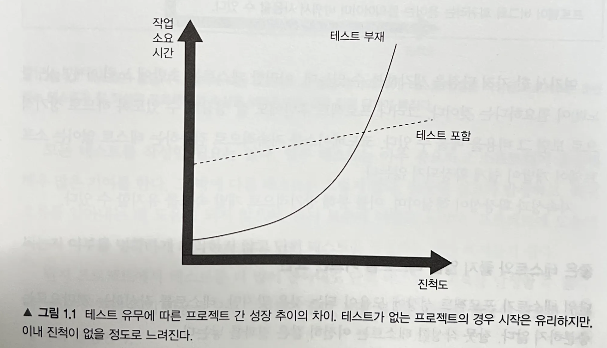
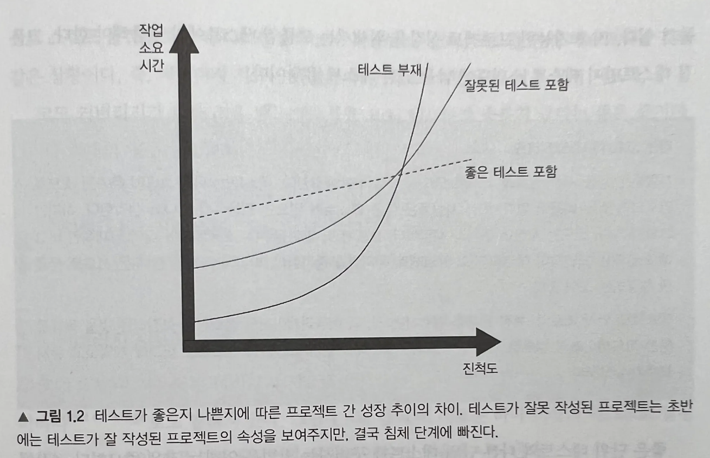

# 1장 단위 테스트의 목표
> 단위 테스트의 목표는 소프트웨어 프로젝트가 지속 가능한 성장을 가능하게 하는 것이다. 지속 가능하다는 것이 핵심이다.

## 테스트 포함 vs 테스트 부재

- 테스트가 없으면 코드베이스에 변경이 생길 때마다 무질서도, 즉 엔트로피가 증가한다. 지속적인 정리와 리팩터링 등과 같은 적절한 관리가 없으면 시스템은 점점 더 복잡해지고 흐트러진다.

- 테스트는 안전망 역할을 하며, 대부분의 회귀에 대한 보험을 제공하는 도구라 할 수 있다.

## 좋은 테스트 포함 vs 잘못된 테스트 포함 vs 테스트 부재

- 좋은 테스트를 작성하는 것이 중요하다.

- 잘못된 테스트를 가졌거나 테스트 자체가 없는 프로젝트는 결국 침체 단계를 피할 수는 없다.

## 가치 있는 테스트만 남기자
- 각각의 테스트는 비용과 편익 요소가 있기 때문에, 둘 다 신중하게 따져볼 필요가 있다.

- 애플리케이션과 테스트 코드는 모두 자산이 아니라 책임이다.

- 테스트 스위트 내에 가치 있는 테스트만 남기고 나머지는 모두 제거하라.

## 커버리지 지표로는 테스트 스위트의 품질을 측정할 수 없다
- 커버리지 지표란?
  - 테스트 스위트가 소스 코드를 얼마나 실행하는지를 백분율로 나타낸 것이다.

- 커버리지 지표는 좋은 부정 지표이지만 나쁜 긍정 지표다.
  - 커버리지가 낮다는 것은 문제의 징후이지만, 커버리지가 높다고 해서 테스트 스위트의 품질이 높다는 것은 아니다.

- 특정 커버리지 숫자를 목표로 하지 말자.
  - 특정 커버리지 숫자를 목표로 하는 것은 단위 테스트의 목표와 반대되는 그릇된 동기 부여가 된다.

  - 사람들은 중요한 것을 테스트하는 데 집중하는 대신 인공적인 목표를 달성하기 위한 방법을 찾기 시작한다.

  - 시스템의 핵심 부분은 커버리지를 높게 갖는 것은 좋지만, 이 높은 수준을 요건으로 삼는 것은 좋지 않다.

- 그렇다면 테스트 스위트 품질은 어떻게 측정해야 하는가?
  - 믿을 만한 방법은 스위트 내 각 테스트를 하나씩 따로 평가하는 것뿐이다.
  
  - 테스트 스위트가 얼마나 좋은지 자동으로 확인할 수 없다. 개인 판단에 맡겨야 한다.

## 성공적인 테스트 스위트의 특성
- 개발 주기에 통합돼 있다.
  - 이상적으로는 코드가 변경될 때마다 실행하는 것이다.

- 코드베이스 중 가장 중요한 부분만을 대상으로 한다.
  - 일반적으로 비즈니스로직(도메인 모델)이 있는 부분이다.

- 최소한의 유지비로 최대의 가치를 끌어낸다.
  - 가치 있는 테스트를 식별하고, 가치 있는 테스트를 작성해야 한다.