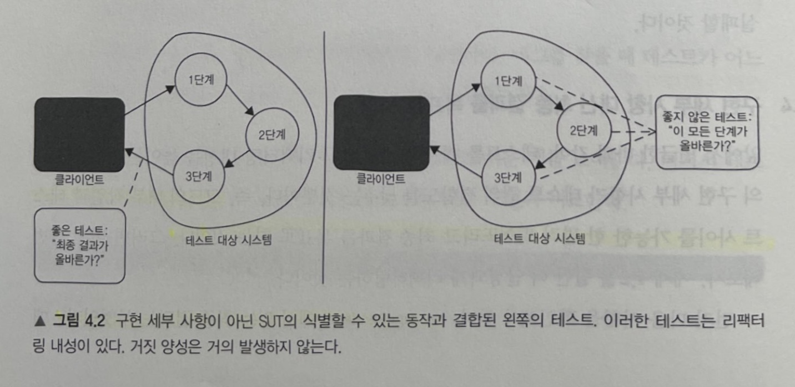
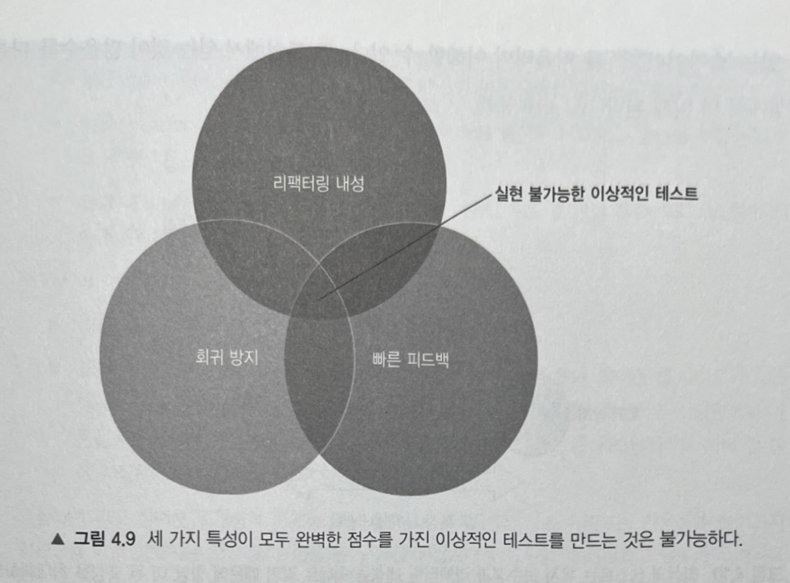
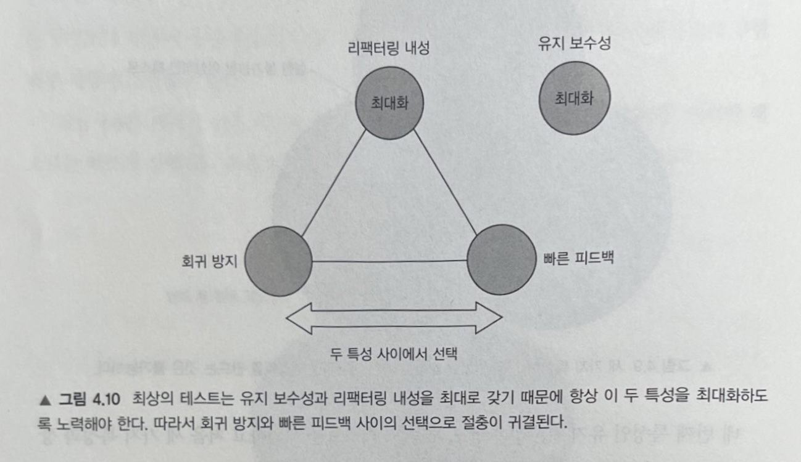
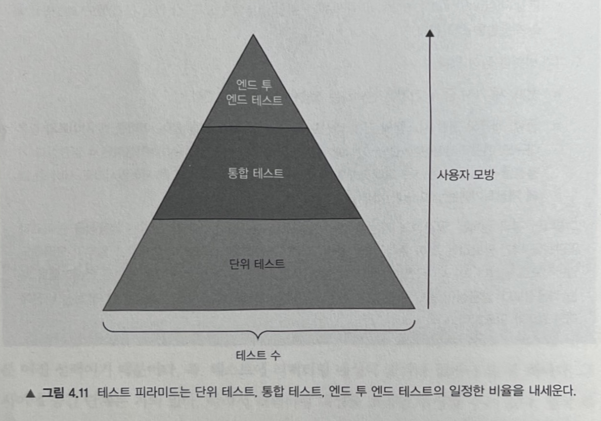
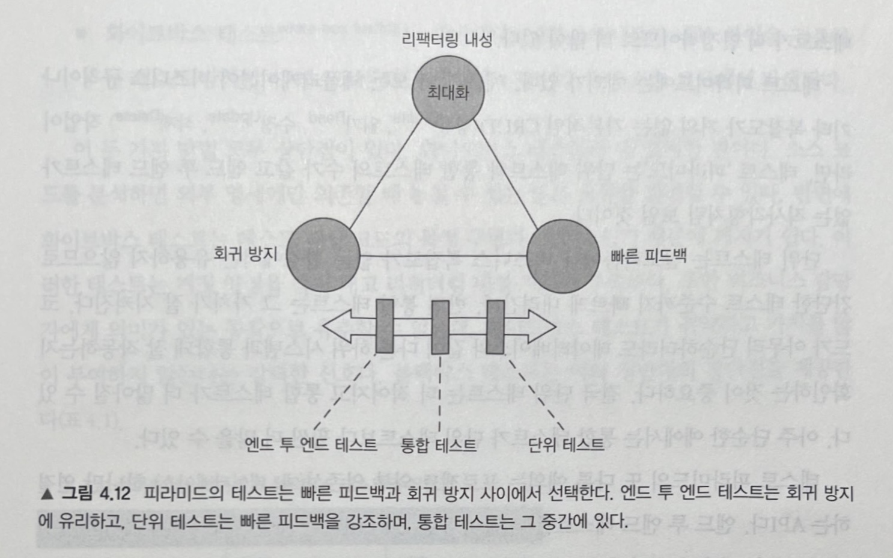

# 4장 좋은 단위 테스트의 4대 요소
> 가치 있는 테스트를 작성하려면 가치 있는 테스트를 식별할 수 있어야 한다.

> 좋은 단위 테스트에는 다음 네 가지 특성이 있다.
> - 회귀 방지
> - 리팩터링 내성
> - 빠른 피드백
> - 유지 보수성

> 이 네 가지 기본 특성으로 단위 테스트 뿐만 아니라, 통합테스트, 엔드 투 엔드 테스트 등 자동화된 모든 테스트를 분석하는 데 사용할 수 있다.

## 회귀 방지
- 회귀란?
    - 회귀는 소프트웨어 버그다.

- 회귀 방지란?
    - 테스트가 얼마나 버그(회귀)의 존재를 잘 나타내는지에 대한 척도이다.

- 회귀 방지 지표에 대한 고려 사항
    - 테스트 중에 실행되는 코드가 많을수록 테스트에서 버그가 드러날 확률이 높아진다.

    - 복잡한 비즈니스 로직을 나타내는 코드가 보일러플레이트 코드보다 훨씬 더 중요하다. 비즈니스에 중요한 기능에서 발생한 버그가 가장 큰 피해를 입히기 때문이다.
    
    - 반면에 단순한 코드를 테스트하는 것은 가치가 거의 없다. 단순한 코드를 다루는 테스트는 실수할 여지가 많지 않기 때문에 회귀 오류가 많이 생기지 않는다.

- 회귀 방지 지표를 극대화하려면 테스트가 가능한 한 많은 코드를 실행하는 것을 목표로 해야 한다.
    - 그런 의미에서 최상의 보호를 위해서는 테스트가 해당 라이브러리, 프레임워크, 외부 시스템을 테스트 범주에 포함시켜서 소프트웨어가 이러한 의존성에 대해 검증이 올바른지 확인한다.

## 리팩터링 내성
- 리팩터링이란?
    - 리팩터링은 식별할 수 있는 동작을 수정하지 않고 기존 코드를 변경하는 것을 의미한다. 그 의도는 코드의 비기능적 특징을 개선하는 것으로 가독성을 높이고 복잡도를 낮추는 것이다.

    - 예를 들면, 메서드 이름을 바꾸는 것이나 코드 조각을 새로운 클래스로 추출하는 것을 생각해볼 수 있다.

- 리팩터링 내성이란?
    - 테스트가 거짓 양성을 내지 않고 애플리케이션 코드 리팩터링을 유지할 수 있는 정도를 의미한다.

### 거짓 양성(false positive)
- 거짓 양성은 허위 경보다.
    - 즉, 코드를 리팩터링하고 기능에는 아무런 문제가 없는데 테스트가 깨지는 상황을 거짓 양성이라고 한다.

- 리팩터링 내성 지표에서 테스트 점수가 잘 나오려면, 거짓 양성이 적게 발생해야 한다.

- 거짓 양성을 신경써야 하는 이유
    - 허위 경보에 익숙해지면, 코드 문제에 대응하는 능력과 의지가 희석된다. 이내 타당한 실패도 무시하기 시작해서 기능이 고장 나도 운영 환경에 들어가게 된다.

    - 거짓 양성이 빈번하면 테스트를 신뢰할 수 있는 안전망으로 인식하지 않는다. 테스트 스위트에 대한 신뢰를 잃게 되어, 리팩터링이 줄어들기 때문에 코드베이스가 나빠질 가능성이 높아진다.

    - 1장에서 언급했던 단위 테스트의 목표는, 프로젝트 성장을 지속 가능하게 하는 것이다. 테스트가 지속 가능한 성장을 하게 하는 메커니즘은 회귀(버그)없이 주기적으로 리팩터링하고 새로운 기능을 추가할 수 있는 것인데, 거짓 양성은 이러한 단위 테스트의 목표를 저해한다.

- 거짓 양성의 원인과 이를 방지하는 방법
    - 테스트와 테스트 대상 시스템(SUT)의 내부 구현 세부 사항이 많이 결합할수록 거짓 양성이 많이 생긴다.

    - 결합도를 낮추려면 테스트는 SUT가 수행한 단계가 아니라 SUT가 만든 최종 결과를 검증해야 한다.

    - 좋은 테스트 vs 좋지 않은 테스트
    

## 회귀 방지와 리팩터링 내성 간의 본질적인 관계
- 회귀 방지와 리팩터링 내성은 테스트 정확도에 기여한다.
    - 가능한 한 적은 소음(허위 경보 발생 수)으로 강한 신호(발견된 버그 수)를 생성하면 테스트 정확도를 향상시킬 수 있다.

- 프로젝트 초기에는 거짓 음성으로 인해 버그가 운영 환경에 들어가지 않도록 회귀 방지에 중점을 두는 것이 중요하다.

- 시간이 흐를수록 코드의 리팩터링이 점점 더 필요해짐에 따라 테스트에서 리팩터링 내성도 점점 더 중요해진다.

## 빠른 피드백
- 빠른 피드백은 단위 테스트의 필수 속성으로 테스트가 얼마나 빨리 실행되는지에 대한 척도다.

- 테스트 속도가 빠를수록 더 많은 테스트를 더 자주 실행할 수 있기 때문에 피드백 루프를 대폭 줄일 수 있다.

## 유지 보수성
- 유지 보수성 지표는 유지비를 평가한다.

- 테스트 이해 난이도.
    - 테스트가 작을수록 읽기 쉽다.

    - 단지 라인 수를 줄이기 위해 코드를 인위적으로 압축하면 안된다. 테스트 절차를 생략하지 말라

- 테스트 실행 난이도.
    - 테스트에 관련된 프로세스 외부 의존성은 운영하는 데 시간을 들여야 한다.

    - 예를 들어, 데이터베이스 서버 재부팅, 네트워크 연결 문제 해결 등이 있다.

## 이상적인 테스트를 찾아서
- 테스트의 가치 추정치는 네 가지 특성 각각에서 얻은 점수의 곱이다. 따라서 특성 중 하나라도 0이면, 테스트 가치도 0이 된다.
    ```
    가치 추정치 = [0..1] * [0..1] * [0..1] * [0..1]
    ```

- 처음 세 가지 특성인 회귀 방지, 리팩터링 내성, 빠른 피드백은 상호 배타적이기 때문에 네 가지 특성 모두 최대 점수를 받는 것은 불가능하다. 셋 중 하나를 희생해야 나머지 둘을 최대로 할 수 있다.


- 리팩터링 내성은 타협할 수 없다. 이 특성을 갖고 있는지 여부는 대부분 이진 선택, 즉 리팩터링 내성이 있거나 없거나 둘 중 하나이기 때문이다. 특성 간의 절충은 회귀 방지와 빠른 피드백 사이의 선택으로 귀결된다.


## 테스트 피라미드

- 테스트 피라미드는 단위 테스트, 통합 테스트, 엔드 투 엔드 테스트의 일정한 비율을 일컫는다.

- 엔드 투 엔드 테스트가 가장 적고, 단위 테스트가 가장 많으며, 통합 테스트는 그 중간 정도라 할 수 있다.(물론 예외가 있다.)
    - 엔드 투 엔드 테스트가 적어야 하는 이유는 빠른 피드백 지표에서 매우 낮은 점수를 받고, 유지 보수 성이 결여돼 있기 때문이다. 따라서 엔드 투 엔드 테스트는 가장 중요한 기능에 적용할 때와 단위 테스트나 통합 테스트와 동일한 수준으로 보호할 때만 적용된다.

    - 보통 단위 테스트가 더 안정적이므로 더 많이 있다.

## 피라미드 내 테스트 유형에 따른 선택

- 어느 계층도 리팩터링 내성은 포기하지 않는다.

- 엔드 투 엔드 테스트는 회귀 방지를 선호하는 데 반해, 단위 테스트는 빠른 피드백을 선호한다.

## 블랙박스 테스트와 화이트박스 테스트
- 블랙박스 테스트(black-box testing)
    - 시스템의 내부 구조를 몰라도 시스템의 기능을 검사할 수 있는 소프트웨어 테스트 방법이다. 즉, 애플리케이션이 어떻게 해야 하는지가 아니라 무엇을 해야 하는지를 중심으로 구축한다.

- 화이트박스 테스트(white-box testing)
    - 애플리케이션의 내부 작업을 검증하는 테스트 방식이며, 테스트는 요구 사항이나 명세가 아닌 소스 코드에서 파생된다.

- 리팩터링 내성은 타협할 수 없다. 따라서 테스트를 작성할 떄는 블랙박스 테스트 방법을 사용하라. 테스트를 분석할 때는 화이트박스 방법을 사용하라.
