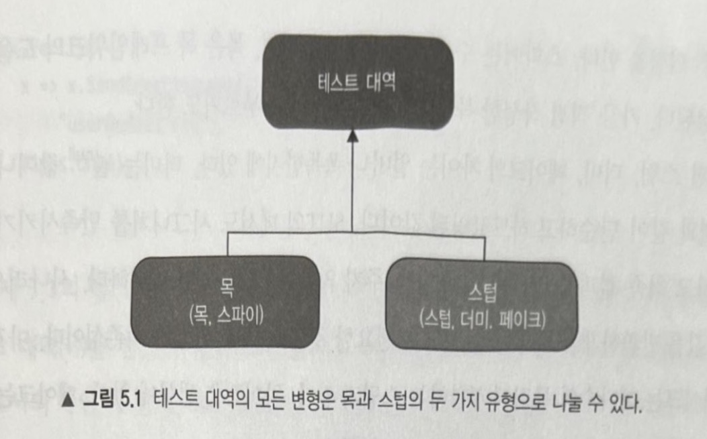
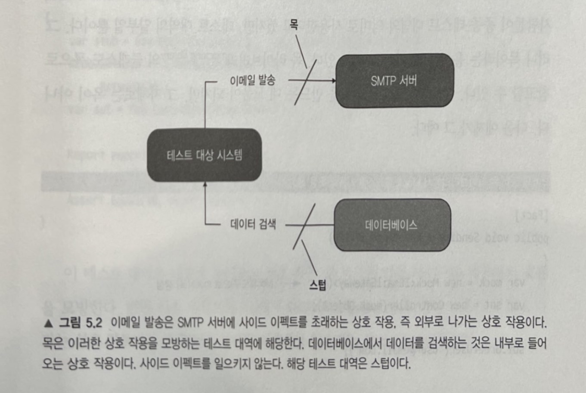

# 5장 목과 테스트 취약성
> 테스트에서 목을 사용하는 것은 논란의 여지가 있는 주제다. ~

- 목은 언제 사용하는 게 좋을까?
- 먼저, 목과 스텁을 구분해야한다.
- 그래서 이런 경우에는 이런 식으로 테스트를 작성하는 게 좋다
- 그러다보면 자연스럽게 이런 아키텍처가 된다.
---
## 목과 스텁 구분
- 테스트 대역이란?
  - 테스트 대역은 모든 유형의 가짜 의존성을 설명하는 포괄적인 용어로, 영화 산업의 '스턴트 대역'이라는 개념에서 비롯됐다.

  - 테스트 대역의 주 용도는 테스트를 편리하게 하는 것이다.

- 테스트 대역의 두 가지 유형
  
  - 테스트 대역에는 더미, 스텁, 스파이, 목, 페이크 등의 다섯 가지 변형이 있는데, 이는 다시 목과 스텁이라는 두 가지 유형으로 분류할 수 있다.

  - 같은 유형 내에서는 각각의 구현 세부 사항에서 미미한 차이가 있다.
    - 따라서 스파이는 기능적으로 목과 같고, 더미와 페이크는 스텁과 같은 역할을 한다.

- 목과 스텁의 차이점
  
  - 목은 외부로 나가는 상호 작용을 모방하고 검사하는 데 도움이 되는 테스트 대역이다.
    - SUT가 의존성의 상태를 변경하기 위해 의존성을 호출하는 것에 해당된다.

  - 스텁은 내부로 들어오는 상호 작용을 모방하는 데 도움이 되는 테스트 대역이다.
    - SUT가 의존성을 호출해 입력 데이터를 가져오는 것에 해당된다.

  - 목은 SUT와 관련된 의존성 간의 상호 작용을 모방하고 검사하는 반면, 스텁은 모방만 한다.

- 도구로서의 목과 테스트 대역으로서의 목
  - 도구로서의 목(Mock)은 테스트 대역으로서의 목이나 스텁을 만드는 데 사용하는 목 라이브러리의 클래스이다. 도구로서의 목을 사용해 목과 스텁, 이 두 가지 유형의 테스트 대역을 생성할 수 있기 때문에 도구로서의 목과 테스트 대역으로서의 목을 혼동하지 않아야 한다.

  - 목 라이브러리에서 Mock 클래스를 사용해 목을 생성
    ```cs
    [Fact]
    public void Sending_a_greetings_email()
    {
      var mock = new Mock<IEmailGateway>(); // Mock(도구로서의 목)으로 mock(테스트 대역으로서의 목) 생성
      var sut = new Controller(mock.Object);

      sut.GreetUser("user@email.com");

      mock.Verify(
        x => x.SendGreetingsEmail("user@email.com"),
        Times.Once); // 테스트 대역으로 하는 SUT의 호출을 검사
    }
    ```

  - Mock 클래스를 사용해 스텁을 생성
    ```cs
    [Fact]
    public void Creating_a_report()
    {
      var stub = new Mock<IDatabase>(); // Mock(도구로서의 목)으로 스텁 생성
      stub.Setup(x => x.GetNumberOfUsers())
          .Returns(10); // 준비한 응답 설정
      var sut = new Controller(stub.Object);

      Report report = sut.CreateReport();

      Assert.Equal(10, report.NumberOfUsers);
    }
    ```
  
- 스텁과의 상호 작용을 검증하지 말라
  >  스텁과의 상호 작용을 검증하는 것은 취약한 테스트를 야기하는 일반적인 안티 패턴이다.

  - SUT에서 스텁으로의 호출은 SUT가 생성하는 최종 결과가 아니다. 이러한 호출은 최종 결과를 산출하기 위한 수단일 뿐이다. 즉, 스텁은 SUT가 출력을 생성하도록 입력을 제공한다.
  
  - 스텁으로 상호 작용 검증(깨지기 쉬운 테스트의 예)
    ```cs
    [Fact]
    public void Creating_a_report()
    {
      var stub = new Mock<IDatabase>();
      stub.Setup(x => x.GetNumberOfUsers()).Returns(10);
      var sut = new Controller(stub.Object);

      Report report = sut.CreateReport();

      Assert.Equal(10, report.NumberOfUsers);
      stub.Verify(
        x => x.GetNumberOfUsers(),
        Times.Once); // 스텁으로 상호 작용 검증(과잉 명세)
    }
    ```
  - 4장에서 살펴봤듯이, 테스트에서 거짓 양성을 피하고 리팩터링 내성을 향상시키는 방법은 구현 세부 사항이 아니라 최종 결과(이상적으로는 비개발자들에게 의미가 있어야 함)를 검증하는 것이였다.  
  `mock.Verify(x => x.SendGreetingsEmail("user@email.com"))`
    - 인사 메일을 보내는 것은 비즈니스 담당자가 시스템에 하길 원하는 결과에 부합한다.

  - `GetNumberOfUsers()`
    - 해당 메서드를 호출하는 것은 보고서 작성에 필요한 데이터를 수집하는 방법에 대한 내부 구현 세부 사항이지 전혀 결과가 아니다.

- 목과 스텁 함께 쓰기
  > 때로는 목과 스텁의 특성을 모두 나타내는 테스트 대역을 만들 필요가 있다.

  - 목이자 스텁인 `storeMock`
  ```cs
  [Fact]
  public void Purchase_fails_when_enough_inventory()
  {
    var storeMock = new Mock<IStore>();
    storeMock
        .Setup(x => x.HasEnoughInventory(Product.Shampoo, 5))
        .Returns(false); // 준비된 응답을 설정
    var sut = new Customer();

    bool success = sut.Purchase(storeMock.Object, Product.Shampoo, 5);
    Assert.False(success);
    storeMock.Verify(
      x => x.RemoveInventory(Product.Shampoo, 5),
      Times.Never); // SUT에서 수행한 호출을 검사
  }
  ```
  - 준비된 응답을 반환하는 `storeMock`
    - `HasEnoughInventory()`

  - SUT에서 수행한 메서드 호출을 검증하는 `storeMock`
    - `RemoveInventory()`
    - 스텁과의 상호 작용을 검증하는 것이 아니다!


    
