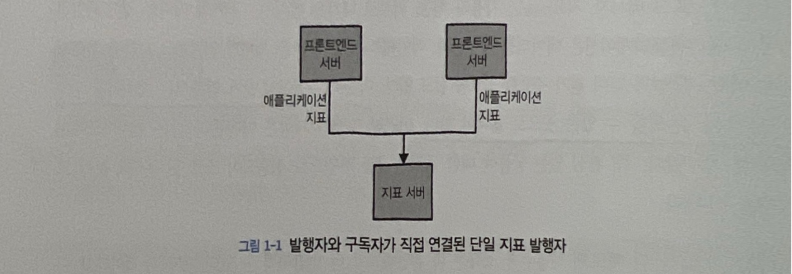
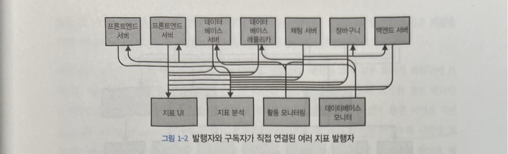
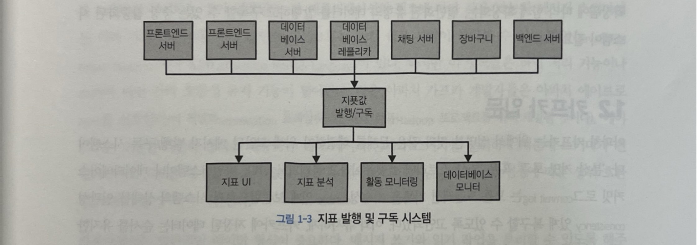
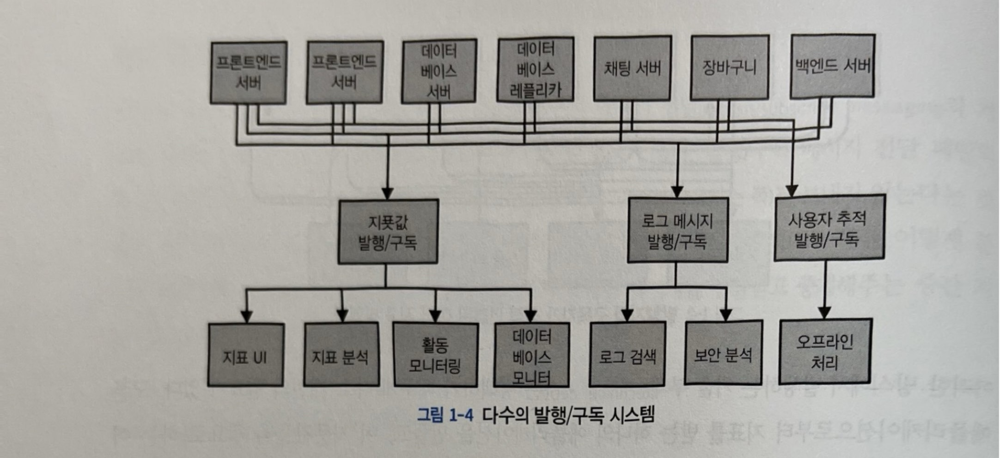
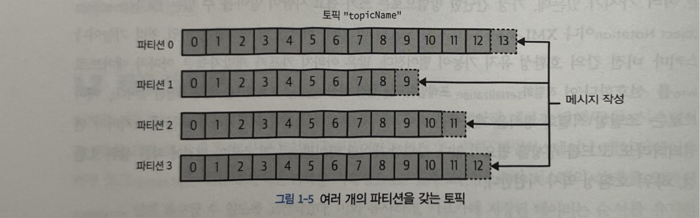
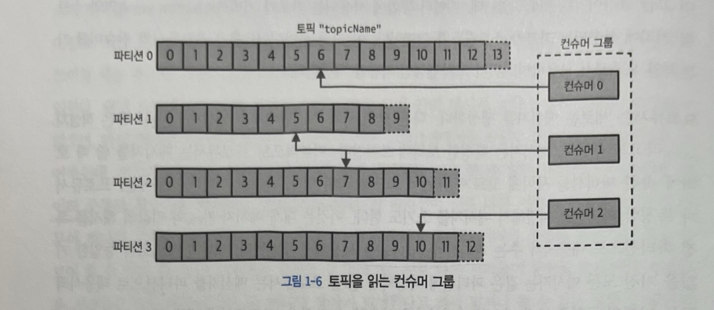
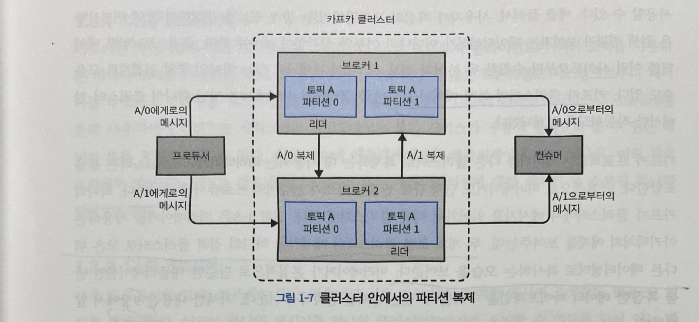
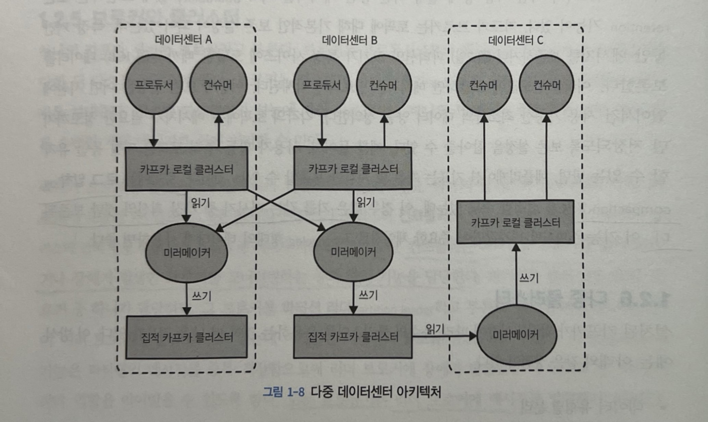

## 데이터 중심의 비즈니스

- 현대의 모든 기업은 데이터에 의해 움직인다
- 애플리케이션이 생성하는 클릭, 조회, 거래, 위치 등 모든 데이터는 의미가 있다
- 그러나 이 데이터는 단지 저장만 해서는 쓸모가 없다

<aside>
💡 데이터는 생성된 곳에서, 분석 가능한 곳으로 신속하게 이동되어야 한다. 데이터를 더 빠르고 효율적으로 이동시킬수록 기업은 더 민첩해지고, 비즈니스에 집중할 수 있다.
</aside>

### 데이터 파이프라인이란?

- 데이터 생성 → 처리 → 전달 → 소비/분석/저장 시점까지의 자동화된 흐름
- 데이터를 실시간 또는 배치로 수집(collect), 변환(transform), 이동(deliver)시키는 일련의 시스템 구성

<aside>
💡 예시. 아마존의 추천 시스템

1. 사용자의 상품 클릭 이벤트 발생
2. 클릭 이벤트가 파이프라인을 통해 스트리밍
3. 추천 엔진이 실시간으로 분석
4. 조금 뒤 개인화된 추천 상품으로 전환되어 사용자의 눈에 보여짐
</aside>

## 발행/구독 메시지 전달

- 전송자(Producer)가 데이터를 보내고, 수신자(Consumer)는 원하는 데이터를 구독하는 모델
- 메시지를 전달받고 중계해주는 브로커(Broker)를 통해 전송자와 수신자는 직접 통신하지 않기 때문에, 유연하고 확장성 있는 구조가 가능함

### 초기의 발행/구독 시스템

1단계. 지표 수집 시스템

- 모니터링을 시작하는 시점에는 간단한 메시지 큐나 프로세스 간 통신 채널을 통해 지표를 수집

2단계. 지표 저장 및 분석 서비스 추가

- 오래가지 않아서 지표값을 장기간에 걸쳐 분석하고 다양한 목적으로 활용하기 위한 새로운 애플리케이션이 계속 추가되어 서버 간 연결이 증가

3단계. 발행/구독 시스템 도입

- 모든 애플리케이션으로부터 지표를 받는 단일 브로커를 구성하여, 지푯값이 필요한 서비스는 이 브로커에서 데이터를 구독한다

4단계. 개별 메시지 큐 시스템

- 지표 데이터를 다루는 것과 같이 동시에 로그 메시지나 사용자 활동 추적 데이터를 다루기 위해 비슷한 세 개의 발행/구독 시스템을 구성한다

### 기존 메시지 큐 방식의 한계

- 여러 개의 발행/구독 시스템을 각각 구축하면 중복이 많아지고 유지보수 비용이 커진다
- 비즈니스가 확장됨에 따라 함께 확장되는, 일반화된 유형의 데이터를 발행하고 구독할 수 있는 중앙 집중화된 시스템이 필요하다

## 카프카 입문

- 아파치 카프카는 위에서 설명한 것과 같은 문제를 해결하기 위해 고안된 메시지 발행/구독 시스템이다
- 일반적으로 ‘분산 커밋 로그’ 또는 ‘분산 스트리밍 플랫폼’이라고 불린다
- 카프카는 데이터를 순서대로 저장하고, 여러 브로커에 분산 저장이 가능하여 확장성과 고가용성을 제공한다

### 메시지와 배치

- 카프카에서 데이터의 기본 단위는 메시지이다
    - 카프카 메시지는 키(key)라고 불리는 메타데이터를 포함할 수도 있으며, 키는 특정 파티션을 결정하는 데 사용된다
    - 키는 보통 해시 함수를 이용하여 파티션에 매핑된다
        
        <aside>
        💡 파티션 수가 변하지 않는 한, 같은 키값을 가진 메시지는 항상 같은 파티션에 저장된다
        
        1. 키값에서 해시값(hash)을 생성
        2. hash % 파티션 수
        3. 나머지 값에 해당하는 파티션에 메시지를 저장
        </aside>
        
- 카프카는 효율성을 위해 메시지를 배치 단위로 모아서 저장하며, 이로 인해 처리량과 지연시간 간의 트레이드오프가 발생한다
    - 즉, 배치 크기가 커질수록 시간당 처리된느 메시지의 수는 늘어나지만, 각각의 메시지가 전달되는 데 걸리는 시간은 늘어난다
    - 배치는 더 효율적인 데이터 전송과 저장을 위해 약간의 처리 능력을 들여서 압축되는 경우가 많다

### 스키마

카프카 입장에서 메시지는 단순한 바이트 배열일 뿐이지만, 내용을 이해하기 쉽도록 일정한 데이터 구조(스키마)를 사용하는 것이 권장된다

- JSON/XML: 사람이 알아보기 쉽고 쓰기 편리하지만, 타입 관리와 스키마 버전 관리가 어려움
- Avro: 조밀한 직렬화 형식을 제공하고, 스키마 변경에 따른 상위 호환성, 하위 호환성을 지원함
    - 많은 아파치 카프카 개발자들이 아파치 에이브로를 선호한다
    - 이 직렬화 프레임워크는 원래 하둡 프로젝트를 위해 개발되었다

<aside>
💡 카프카에서는 일관적인 데이터 형식이 중요하다. 메시지 쓰기와 읽기 작업을 분리할 수 있도록 해주기 때문이다.

</aside>

### 토픽과 파티션

토픽(Topic)

- 토픽은 카프카에서 데이터를 분류하는 단위로, 데이터베이스의 테이블이나 파일시스템의 폴더와 유사하다
- 토픽은 하나 이상의 파티션으로 구성된다

파티션(Partition)

- 파티션은 메시지가 실제 저장되는 단위로, 메시지가 쓰여질 때는 추가만 가능한 형태로 쓰여지며, 읽을 때는 맨 앞부터 제일 끝까지의 순서로 읽힌다
- 각 파티션 내에서는 순서가 보장되나, 서로 다른 파티션 간의 순서는 보장되지 않는다

<aside>
💡 파티션을 나누는 이유?

프로듀서와 컨슈머가 병렬 처리할 수 있어 처리량(throughput)을 늘릴 수 있다. 하나의 파티션은 단일 로그 파일이기 때문에, 디스크 쓰기, 읽기도 단일 스레드로만 이루어진다. 파티션을 N개로 나누면, 프로듀서와 컨슈머가 N개의 로그에 병렬로 I/O를 분산시켜 거의 N배의 처리량을 확보할 수 있다.

</aside>

<aside>
💡 파티션 수 주의사항!!

파티션 수는 늘릴 수 있지만 줄일 수는 없다. 늘릴 때는 기존 메시지에 대한 이동은 없고, 키 매핑이 바뀌어 순서 보장 구간이 달라진다는 점을 반드시 고려해야 한다. 또한 파티션 수를 늘리면, 카프카는 컨슈머 그룹 전체에 리밸런스를 트리거한다. 이 과정에서 일시적으로 처리 중단이 일어날 수 있다. 따라서 파티션은 초기 설계 시 여유 있게 잡아두는 것이 좋다.

</aside>

### 프로듀서와 컨슈머

카프카 클라이언트로서 기본적으로 프로듀서와 컨슈머 두 종류가 있다.

프로듀서(Producer)

- 메시지를 생성하여 특정 토픽의 파티션에 전송한다
- 기본적으로 프로듀서는 메시지를 쓸 때 토픽에 속한 파티션들 사이에 고르게 나눠 쓰도록 되어있다
- 파티셔너(partitioner)를 사용해서 특정 파티션을 지정할 수도 있다

컨슈머(Consumer)

- 하나 이상의 토픽을 구독하여 파티션에서 메시지를 읽어온다
- 컨슈머 그룹은 각 파티션이 하나의 컨슈머에 의해서만 읽히도록 한다
- 컨슈머에서 파티션으로의 대응 관계는 컨슈머의 파티션 소유권이라고도 부른다
- 컨슈머 중 하나에 장애가 발생하더라도, 그룹 안의 다른 컨슈머들이 파티션을 재할당받은 뒤 이어서 데이터를 읽어올 수 있다

### 브로커와 클러스터

브로커(Broker)

- 하나의 카프카 서버를 브로커라고 한다
- 브로커는 메시지 저장과 전달을 책임진다
- 파티션 복제(replication) 기능을 통해 브로커는 파티션의 리더 혹은 팔로워로 구성되며, 리더 브로커에 장애가 발생했을 때 팔로워 중 하나가 리더 역할을 이어받을 수 있다
- 모든 프로듀서는 리더 브로커에 메시지를 발행해야 하지만, 컨슈머는 리더나 팔로워 중 하나로부터 데이터를 읽어올 수 있다

클러스터

- 하나의 클러스터 안에는 여러 개의 브로커가 포함될 수 있으며, 그중 하나의 브로커가 클러스터 컨트롤러의 역할을 하게 된다.
- 컨트롤러는 파티션을 브로커에 할당해주거나 장애가 발생한 브로커를 모니터링하는 등의 관리 기능을 담당한다

### 메시지 보존과 로그 압착

보존(retention)

- 아파치 카프카의 핵심 기능 중에 일정 기간 동안 메시지를 지속성있게 보관하는 보존 기능이 있다
- 각각의 토픽에 메시지가 필요한 정도까지만 저장되도록 보존 설정을 잡아줄 수 있다

로그 압착(Log Compaction)

- 로그 압착 기능 설정을 통해, 동일 키를 갖는 메시지 중 가장 최신 메시지만 보존되도록 할 수 있다.
- 이 기능은 마지막 변경값만이 중요한 체인지로그(changelog) 형태의 데이터에 사용하면 좋다

### 다중 클러스터

- 다중 클러스터 운영은 데이터 유형별 격리, 보안 강화, 재해 복구(disaster recovery, DR)를 위해 사용된다
- 미러메이커(MirrorMaker)는 클러스터 간 데이터 복제를 지원하는 도구로, 근본적으로 단지 큐로 연결된 카프카 컨슈머와 프로듀서에 불과하다. 하나의 카프카 클러스터에서 메시지를 읽어와서 다른 클러스터에 쓴다.
    - 두 개의 로컬 클러스터의 메시지를 하나의 직접 클러스터로 모은 뒤 다른 데이터센터로 복사하는 모습을 보여준다

## 왜 카프카인가?

메시지 발행/구독 시스템으로는 RabbitMQ, ActiveMQ, AWS SNS/SQS, Google Pub/Sub 등 다양한 옵션이 있다. 그렇다면 카프카가 좋은 이유에는 무엇이 있을까?

### 다중 프로듀서

- 카프카는 여러 프로듀서를 처리할 수 있기 때문에, 많은 프론트엔드 시스템으로부터 데이터를 수집하고 일관성을 유지할 수 있다

### 다중 컨슈머

- 하나의 메시지를 하나의 클라이언트에서만 소비할 수 있도록 되어 있는 많은 큐 시스템과의 결정적인 차이점으로, 다수의 카프카 컨슈머는 컨슈머 그룹의 일원으로 작동함으로써 하나의 스트림을 여럿이서 나눠서 읽을 수 있다.

### 디스크 기반 보존

- 카프카는 메시지를 디스크에 저장하기 때문에 일정 기간 동안 메시지를 지속성 있게 보관할 수 있다
- 컨슈머가 중단되더라도 메시지는 카프카 안에 남아있기 때문에, 컨슈머가 다시 시작되면 작업을 멈춘 지점에서부터 유실 없이 데이터를 처리할 수 있다

### 확장성

- 카프카 클러스터는 작동 중에도 시스템 전체의 가용성에 영향을 주지 않으면서 확장이 가능하다

### 고성능

- 프로듀서, 컨슈머, 브로커 모두가 매우 큰 메시지 스트림을 쉽게 다룰 수 있도록 수평적으로 확장될 수 있기 때문에 고부하 아래에서도 높은 성능을 달성할 수 있다

### 플랫폼 기능

- 아파치 카프카의 코어 프로젝트에 개발자들이 자주 하는 작업을 훨씬 쉽게 수행할 수 있도록 해주는 플랫폼 기능이 추가되어 있다.
- 카프카 커넥트를 통해 소스 데이터 시스템으로부터 데이터를 가져와 싱크 시스템으로 내보내는 작업을 할 수 있다
- 카프카 스트림즈를 통해 규모 가변성(scalability)과 내고장성(fault tolerance)을 갖춘 스트림 처리 애플리케이션을 쉽게 개발할 수 있다

## 카프카의 기원

카프카는 링크드인의 내부 데이터 파이프라인 문제 해결을 위해 개발되었다. 링크드인에서 처음 의도했던 카프카의 원래 용도는 사용자 활동 추적이었다.

### 링크드인이 직면한 문제

링크드인은 데이터 관리를 위해 내부적으로 사용하는 시스템이 있었으나, 다음과 같은 문제가 있었다

- 지표 수집 간격이 길어서 실시간 대응 불가
- 애플리케이션 담당자가 자신의 애플리케이션에서 수집된 지표 관리 불가
- 비효율적이고 일관성 없는 수동 관리
- XML 형식 기반 시스템의 성능 및 유지보수 문제
- 모니터링 시스템과 사용자 활동 추적 시스템 간의 데이터 형식 불일치로 호환성 없음

이러한 문제를 해결하기 위해 이미 나와 있는 오픈 소스 솔루션들을 검토했으나 규모 확장성 문제와 안정성 부족으로 데이터 파이프라인을 구축하기 위한 커스텀 인프라스트럭처를 자체 개발함

### 카프카 개발의 주요 목표

- 푸시-풀 모델을 사용함으로써 프로듀서와 컨슈머의 명확한 분리
- 다수의 컨슈머가 사용할 수 있도록 메시지 교환 시스템의 데이터를 영속적으로 저장
- 높은 메시지 처리량 보장
- 데이터 스트림의 양이 증가함에 따라 시스템을 수평 확장할 수 있도록 한다

<aside>
💡 카프카의 규모 확장성 덕북에 카프카는 링크드인 안에서 (2020년 2월 기준) 매일 7조 개의 메시지를 쓰고 5페타바이트가 넘는 데이터를 읽을 수 있는 시스템으로 성장할 수 있었다..
</aside>

### 오픈소스

- 2010년 말 깃허브에 오픈소스로 공개
- 2011년 7월 아파치 소프트웨어 재단의 인큐베이터 프로젝트로 채택
- 2012년 10월 정식 아파치 프로젝트로 전환
- 현재 링크드인을 비롯해 넷플릭스, 우버 등 세계에서 가장 큰 데이터 파이프라인에서 사용되고 있다

### 상업적 제품

2014년 가을, 카프카의 초기 개발자인 제이 크랩스, 네하 나크헤데, 준 라오는 링크드인을 떠나 카프카 관련 서비스를 전문적으로 제공하는 기업 컨플루언트(Confluent)를 창업했다.

### 이름

카프카라는 이름은 체코의 유명 작가 프란츠 카프카에서 유래했다. 개발자인 제이 크랩스는 쓰기 최적화 시스템에 작가의 이름을 붙이는 것이 적절하다고 생각했고, 오픈소스 프로젝트 이름으로 멋지다고 생각함.

따라서 카프카의 이름과 기능 사이에는 별 관계가 없다고 할 수 있겠다~~