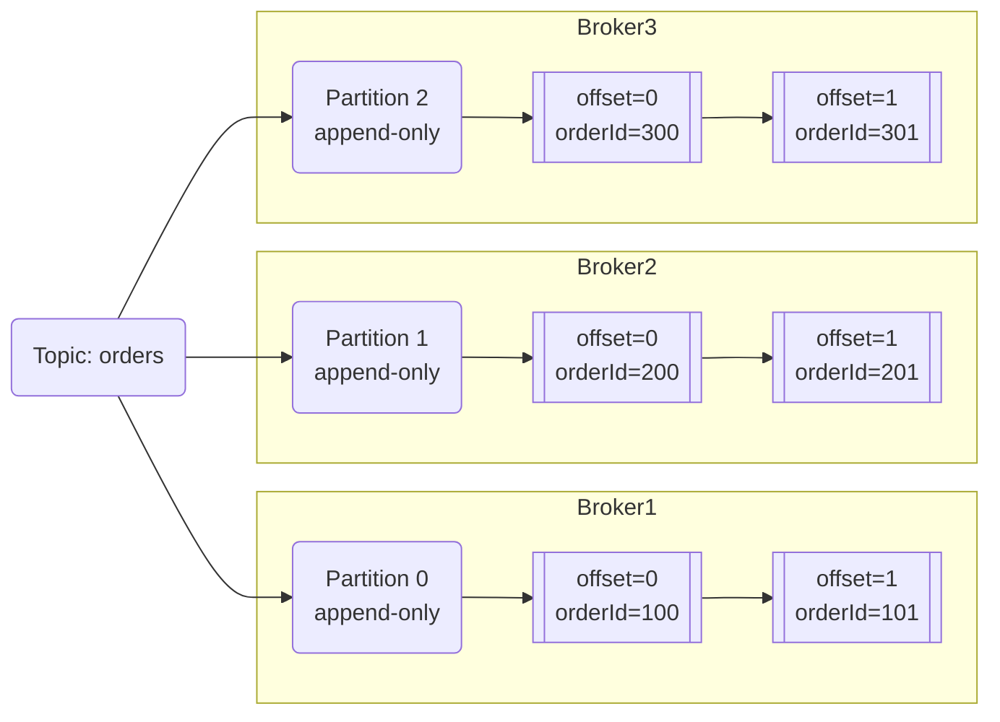
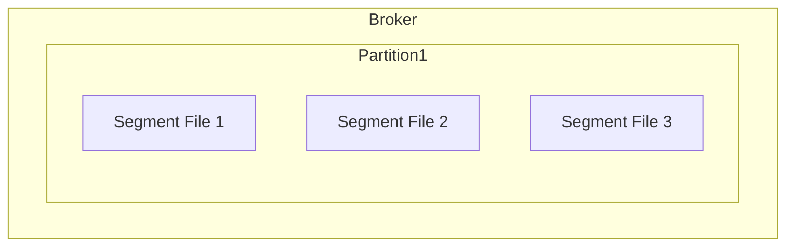
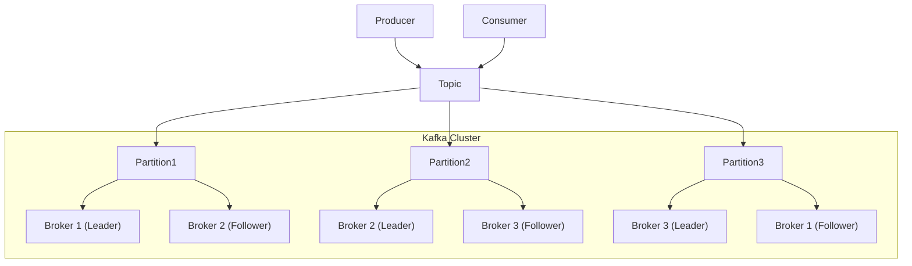
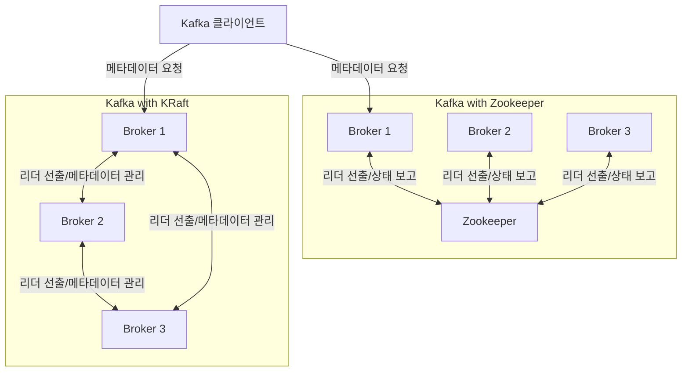
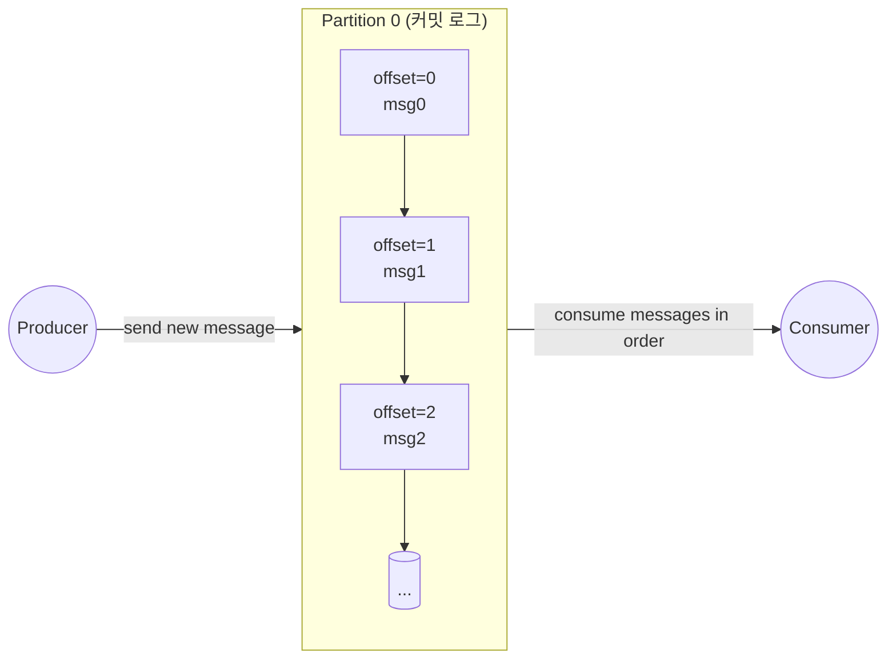

## 2장 카프카 알아보기

## 카프카

카프카는 이벤트 스트리밍을 위한 분산 메시징 플랫폼입니다.

다양한 소스(애플리케이션, 시스템)에서 발생하는 이벤트를 실시간으로 받아 저장하고, 이를 여러 컨슈머나 다운스트림 시스템에 전달함으로써 유연하고 확장성 있는 데이터 파이프라인을 구성할 수 있습니다.

## 이벤트와 토픽

이벤트란?

- 레코드 또는 메시지라고 불립니다.
- 예를 들어, 어떤 사건이 발생했다라는 사실은 담은 한 건의 메시지
- 이벤트에는 키(Key), 값(Value) 그리고 타임스탬프나 헤더 같은 추가 메타데이터가 있을 수 있습니다.

토픽이란?

- 메시지를 논리적으로 분류하는 카테고리 또는 주제(채널)입니다.
- 예를 들어, 사용자 로그, 주문 정보, 시스템 모니터링 등 용도에 맞는 여러 토픽을 구성할 수 있습니다.
- 컨슈머는 특정 토픽을 구독하거나, 해당 토픽에서 메시지를 가져와 처리합니다.

## 파티션

- 하나의 토픽은 하나 이상의 파티션으로 나뉘어 물리적으로 데이터가 저장됩니다.
- 각 파티션은 카프카 클러스터 내 서로 다른 브로커(서버)에 분산 배치될 수 있어, 확장성과 부하 분산을 높입니다.
- 파티션 안에서 메시지들은 Offset 순서대로 기록되어, 파티션 내부에서는 메시지의 순서가 보장됩니다.
- 반면, 서로 다른 파티션 간에는 순서가 보장이 되지 않으므로, 순서가 중요한 메시지들은 동일 파티션으로 저장하도록 설계해야 합니다.
    - 이벤트 키가 있으면, 키에 대한 해시값으로 파티션을 배정하여, 같은 키를 가진 이벤트는 항상 같은 파티션에 쌓이게 되므로, 파티션 내에서의 순서가 보장됩니다.
    - 이벤트 키가 없으면, 라운드 로빈 방식으로 파티션을 배정하여, 순차적으로 파티션을 돌면서 메시지를 분산하게 되므로, 메시지 순서 보장은 되지 않습니다.

## 세그먼트

카프카에서 각 파티션의 데이터는 실제로 세그먼트라는 더 작은 파일 단위로 저장됩니다. 파티션이 커지면 메시지를 효율적으로 관리하기 어렵기 때문에, 카프카는 특정 크기 또는 시간이 경과하면 새로운 세그먼트 파일을 생성하여 메시지를 관리합니다.

세그먼트 파일을 통해 카프카는 데이터를 빠르게 읽고 쓰며, 오래된 데이터의 삭제나 압축 등을 효율적으로 처리할 수 있습니다.

## 레플리카와 리더

카프카는 데이터 유실을 방지하고 고가용성을 유지하기 위해 각 파티션을 여러 브로커에 복제하여 관리합니다. 이를 레플리카라고 합니다.

레플리카 중 하나는 리더로 선출되며, 나머지는 팔로워로서 리더의 데이터를 지속적으로 복제합니다. 카프카 클라이언트(프로튜서와 컨슈머)는 토픽을 통해 데이터를 주고 받는데, 이때 토픽은 내부적으로 리더 레플리카를 통해 데이터를 쓰거나 읽습니다.

리더 레플리카에 장애가 발생하면, 카프카 클러스터는 팔로워 레플리카 중 하나를 새로운 리더로 선출하여 장애를 빠르게 복구합니다. 이를 통해 일부 브로커에서 장애가 발생하더라도 시스템의 중단 없이 데이터의 고가용성을 보장할 수 있습니다.

## 주키퍼(Zookeeper)의 역할과 KRaft 방식

주키퍼는 카프카에서 분산 시스템의 코디네이션을 담당하는 컴포넌트입니다.

카프카는 원래 주키퍼를 사용하여 클러스터의 상태 정보, 브로커의 메타데이터 관리, 파티션의 리더 레플리카 선출과 같은 작업을 수행했습니다. 그러나 최근 카프카 버전 3.0부터는 점차 주키퍼의 의존성을 없애고, 카프카 브로커들이 자체적으로 메타데이터를 관리하는 방식인 KRaft(Kafka Raft Metadata Mode)를 지원하기 시작했습니다.

## 카프카의 고가용성 아키텍처

카프카는 빠른 메시지 처리를 위해 JVM의 힙 메모리가 아닌 운영체제의 페이지 캐시(page cache)를 활용합니다. 이는 카프카가 많은 데이터를 메모리에 로드하지 않고도 높은 처리량을 유지할 수 있게 만든 설계입니다. 이러한 설계는 JVM 힙 메모리 사용으로 인한 가비지 컬렉션 문제를 방지할 수 있습니다.

## 커밋 로그

카프카는 분산 커밋 로그라고도 자주 불리는 만큼 커밋 로그는 카프카의 핵심 개념 중 하나입니다.

파티션 내부 구조는 연속된 로그 형태로 되어있습니다.

어떤 토픽을 생성하면 내부적으로 파티션 별로 연속된 로그 구조가 만들어지고, 각 메시지(레코드)는 오프셋 순서대로 항상 마지막에 추가됩니다. 따라서 컨슈머는 어디까지 읽었는지를 오프셋으로 관리할 수 있습니다. 오프셋 관리를 통해 컨슈머는 어디까지 읽었는지를 알 수 있고, 원하는 지점부터 데이터를 재처리할 수도 있습니다.

### 그렇다면 카프카에서 데이터를 얼마나 오래 유지할 수 있을까?

스토리지의 로그 영속성은 카프카를 다른 메시지 브로커와 구별 짓는 주요 부분입니다.

책에서 세부적인 보존기간에 대한 설명은 6장 브로커에 관해 이야기할 때 다룬다고 했지만, 저는 찾지 못했습니다.. 어쨌든 로그 데이터 보존기간이 구성 속성(configuration proerty)를 사용해 시간과 크기로 제어가 가능하다고 나오는데요, 찾아보니 기본 보존 기간은 다음과 같습니다. 또한, 카프카의 리텐션 정책은 토픽별로 독립적으로도 설정 가능합니다.

- 시간 기반 리텐션
    - log.retention.hours = 168
    - 168시간, 즉 7일 동안 메시지 유지
- 크기(용량)기반 리텐션
    - log.retention.bytes 옵션을 사용해, 파티션별로 저장 가능한 바이트 수의 한도 설정
    - 설정된 용량을 초과하면 오래된 메시지부터 삭제

## 코드 예제 실행

…

## 참고

- [Apache Kafka 공식 문서](https://kafka.apache.org/documentation/)
- [Kafka Improvement Proposals(KIP)](https://cwiki.apache.org/confluence/display/KAFKA/Kafka+Improvement+Proposals)
- [KIP-500: Replace ZooKeeper with a Self-Managed Metadata Quorum](https://cwiki.apache.org/confluence/display/KAFKA/KIP-500%3A+Replace+ZooKeeper+with+a+Self-Managed+Metadata+Quorum)
- [Kafka Broker, Partition, Segment 파일 개념 설명](https://magpienote.tistory.com/252)