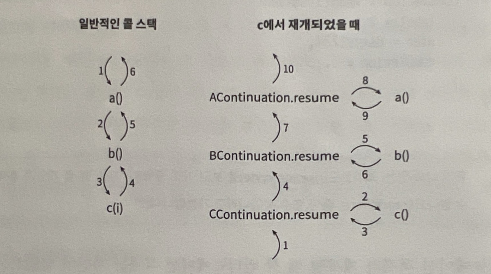

# 코루틴의 실제 구현

## 코루틴의 내부 구현과 동작 과정에 대해 이해하는 데 있어서 중요한 점
- 중단 함수는 함수가 시작할 때와 중단 함수가 호출되었을 때 상태를 가진다는 점에서 상태 머신`state machine`과 비슷하다.
- 컨티뉴에이션`continuation` 객체는 상태를 나타니는 숫자와 로컬 데이터를 가지고 있다.
- 함수의 컨티뉴에이션 객체가 이 함수를 부르는 다른 함수의 컨티뉴에이션 객체를 장식`decorate`한다. 그 결과, 모든 컨티뉴에이션 객체는 실행을 재개하거나 재개된 함수를 완료할 때 사용되는 콜 스택으로 사용된다.

## 컨티뉴에이션 전달 방식
중단 함수가 구현될 수 있는 수많은 방법 중에서 코틀린 팀은 컨티뉴에이션 전달 방식 `continuation-passing style`을 택했다.
> https://en.wikipedia.org/wiki/Continuation-passing_style

프로그램의 제어 흐름을 다음에 무엇을 할지를 나타내는 함수(컨티뉴에이션)로 명시적으로 넘기는 코드 스타일이다.  
함수는 값을 `return`하지 않고, 계산 결과를 들고 `k`를 호출한다.
### Direct Style
```kotlin
fun add1(x: Int): Int = x + 1
fun twice(x: Int): Int = add1(add1(x)) //return으로 이어 붙임
```

### CPS Style
```kotlin
//k: (Int) -> Unit이 다음에 할 일
fun add1(x: Int, k: (Int) -> Unit) {
  k(x + 1) //Int 결과를 결과를 return하지 않고 k에 넘김
}
fun twice(x: Int, k: (Int) -> Unit) {
  add1(x) { y -> //x+1 결과를 y로 받아
    add1(y, k) //y+1 결과를 k로 넘김
  }
}
```
`return`이 아니라 다음에 할 일 `k`를 호출하기 때문에, 지금이 아니라 나중에 이어갈 수 있다. 코루틴의 내부 모델(중단/재개)에서 사용되는 방식이다.

이전에 설명했던 것처럼 컨티뉴에이션은 함수에서 함수로 인자를 통해 전달된다. 관례상 컨티뉴에이션은 마지막 파라미터로 전달된다.

### 중단 함수 내부
``` kotlin
suspend fun getUser(): User?
suspend fun setUser(user: User)
suspend fun checkAvailability(flight: Flight): Boolean

//자세히 들여다 보면
fun getUser(continuation: Continuation<*>): Any?
fun setUser(user: User, continuation: Continuation<*>): Any
fun checkAvailability(
  flight: Flight,
  continuation: Continuation<*>
): Any
```
중단 함수 내부를 들여다 보면 원래 선언했던 형태와 반환 타입이 달라졌다는 걸 알 수 있다.
> `Any` 또는 `Any?`로 바뀐 이유는 뭘까?

이는 중단 함수를 실행하는 도중에 중단되면 선언된 타입의 값을 반환하지 않을 수 있기 때문이다. 이때 중단 함수는 나중에 살펴볼 특별한 마커(marker)인 `COROUTINE_SUSPENDED`를 반환한다.
- 지금은 `getUser` 함수가 `User?` 또는 `COROUTINE_SUSPENDED`를 반환할 수 있기 때문에 결과 타입이 `User?`와 `Any`의 가장 가까운 슈퍼타입(supertype)인 `Any?`로 지정되었다는 것만 확인하자.


## 아주 간단한 함수
```kotlin
suspend fun myFunction() {
  println("Before")
  delay(100) //중단 함수
  println("After")
}
```

### myFunction 함수의 시그니처(signature)
`myFunction`함수의 시그니처를 다음과 같이 추론할 수 있다.
```kotlin
fun myFunction(continuation: Continuation<*>): Any
```
이 함수는 상태를 저장하기 위해 자신만의 컨티뉴에이션 객체가 필요하다.
- 이를 `myFunctionContinuation`이라 하겠다(실제로 컨티뉴에이션은 이름이 없는 객체의 표현식이지만 이해를 돕기 위해 이름을 붙였다).

### MyFunctionContinuation으로 포장
본체가 시작될 때 `MyFunction`은 파라미터인 `continuation`을 자신만의 컨티뉴에이션인 `myFunctionContinuation`으로 포장한다.
```kotlin
val continuation = MyFunctionContinuation(continuation)
```
단, 클래스에 포장이 없는 경우에만 클래스를 포장해야 한다. 만약 코루틴이 재실행되고 있으면 컨티뉴에이션 객체는 이미 래핑되어 있을 것이므로 컨티뉴에이션 객체를 그대로 둬야 한다.
```kotlin
val continuation = 
  if (continuation is MyFunctionContinuation) continuation
  else MyFunctionContinuation(continuation)
```
- 실제 작동하는 방식은 중단 함수가 재귀를 지원하기 위해, `label`의 첫 번째 비트가 바뀌고 중단 함수가 바뀐 값을 확인하는 과정이 있어 약간 더 복잡하다. 좀더 간단한 설명을 위해 이 과정은 생략되었다.

다음과 같이 간단하게 만들 수도 있다.
```kotlin
val continuation = continuation as? MyFunctionContinuation
  ?: MyFunctionContinuation(continuation)
```

### 다시 아주 간단한 함수
이제 함수의 본체를 다시 보자.
```kotlin
suspend fun myFunction() {
  println("Before")
  delay(100) //중단 함수
  println("After")
}
```
함수가 시작되는 지점은 함수의 시작점(함수가 처음 호출될 때)과 중단 이후 재개 시점(컨티뉴에이션이 `resume`을 호출할 때) 두 곳이다.  

현재 상태를 저장하려면 `label`이라는 필드를 사용한다.
- 함수가 처음 시작할 때 이 값은 0으로 설정된다.
- 이후에는 중단되기 전에 다음 상태로 설정되어 코루틴이 재개될 시점을 알 수 있게 도와준다.

### MyFunction의 세부 구현
`MyFunction`의 세부 구현을 간단하게 표현하면 다음과 같다.
```kotlin
fun myFunction(continuation: Continuation<Unit>): Any {
  val continuation = continuation as? MyFunctionContinuation
    ?: MyFunctionContinuation(continuation)

  if (continuation.label == 0) {
    println("Before")
    continuation.label = 1
    if (delay(1000, continuation) == COROUTINE_SUSPENDED) {
      return COROUTINE_SUSPENDED
    }
  }
  if (continuation.label == 1) {
    println("After")
    return Unit
  }
  error("Impossible")
}
```
위 코드에서 중요한 부분은, `delay`에 의해 중단된 경우 `COROUTINE_SUSPENDED`가 반환되며, `myFunction`은 `COROUTINE_SUSPENDED`를 반환한다.
  - `myFunction`을 호출한 함수부터 시작해 콜 스택에 있는 모든 함수도 똑같다(좀더 구체적으로 설명하면, `COROUTINE_SUSPENDED`는 빌더 함수나 '재개(`resume`)' 함수에 도달할 때까지 전달이 된다). 따라서 중단이 일어나면 콜 스택에 있는 모든 함수가 종료되며, 중단된 코루틴을 실행하던 스레드를 (다른 종류의 코루틴을 포함해) 실행 가능한 코드가 사용할 수 있게 된다.

> `delay` 호출이 `COROUTINE_SUSPENDED`를 반환하지 않았다면 어떻게 될까? 그렇지는 않겠지만 대신에 `Unit`을 반환한다면?

`delay`의 반환값이 `Unit`일 경우 다음 상태로 바뀌도 다른 함수와 다름없는 동작을 할 것이다.

``` text
내 생각에는, 여기가 코루틴의 중요한 이점이 드러나는 부분이 아닐까 싶다. delay가 COROUTINE_SUSPENDED를 반환하면 코루틴만 중단되고 스레드는 비워져서 다른 작업이 그 스레드를 쓸 수 있다. 덕분에 적은 스레드로도 많은 동시 작업(주로 IO 대기 관련) 처리가 가능해질 것 같다.

delay가 Unit을 반환한다면, 즉, 실제로는 중단이 일어나지 않는다면, 호출한 suspend 함수가 그냥 일반 함수처럼 현재 스레드를 계속 써서 동기적으로 계속 실행될 것이다.
```

### 익명 클래스(anonymous class)로 구현된 컨티뉴에이션 객체
이제 익명 클래스로 구현된 컨티뉴에이션 객체에 대해 알아보자. 간단하게 나타내면 다음과 같다.
```kotlin
cont = object : ContinuationImpl(continuation) {
  var result: Any? = null
  var label = 0

  override fun invokeSuspend(`$result`: Any?): Any? {
    this.result = `$result`;
    return myFunction(this);
  }
}
```

### 지금까지 설계한 함수를 간략화한 최종 모습
가독성을 위해 컨티뉴에이션 객체를 `MyFunctionContinuation`이라는 클래스로 나타내겠다. `ContinuationImpl`의 본체를 내부로 옮겨 상속 관계는 숨기도록 했다.
```kotlin
fun myFunction(continuation: Continuation<Unit>): Any { //1. myFunction(parent) 최초 호출
  val continuation = continuation as? MyFunctionContinuation
    ?: MyFunctionContinuation(continuation) //2. 이 프레임의 상태 정보를 담을 컨티뉴에이션으로 감싸기

  if (continuation.label == 0) {
    println("Before")
    continuation.label = 1 //다음 재진입 지점 설정
    if (delay(1000, continuation) == COROUTINE_SUSPENDED) {
      return COROUTINE_SUSPENDED //3. 중단 발생
    }
    //여기까지 온 경우는 중단이 없는 경우
  }
  if (continuation.label == 1) {
    println("After")
    return Unit //6. After 출력 및 Unit 반환
  }
  error("Impossible")
}

class MyFunctionContinuation(
  val completion: Continuation<Unit> //이 프레임이 끝나면 결과를 넘길 상위 객체
) : Continuation<Unit> {
  override val context: CoroutineContext
    get() = completion.context

  var label = 0 //상태 머신의 분기 라벨
  var result: Result<Any>? = null //직전 중단 지점의 결과

  override fun resumeWith(result: Result<Unit>) { //4. 1초 후 재개
    this.result = result
    val res = try {
      val r = myFunction(this) //5. myFunction(this) 재호출 -> label == 1로 분기 실행
      if (r == COROUTINE_SUSPENDED) return //다시 중단되는 경우
      Result.success(r as Unit)
    } catch (e: Throwable) {
      Result.failure(e)
    }
    completion.resumeWith(res) //7. 상위 컨티뉴에이션에 결과를 전파
  }
}
```

## 상태를 가진 함수
함수가 중단된 후에 다시 사용할 지역 변수나 파라미터와 같은 상태를 가지고 있다면, 함수의 컨티뉴에이션 객체에 상태를 저장해야 한다.

### 다시 등장한 간단한 함수
```kotlin
suspend fun myFuntion() {
  println("Before")
  var counter = 0
  delay(1000) //중단 함수
  counter++
  println("Counter: $counter")
  println("After")
}
```
여기서 `counter`는 0과 1로 표시된 두 상태에서 사용되므로 컨티뉴에이션 객체를 통해 이를 저장해야 한다.  
지역 변수나 파라미터 같이 함수 내에서 사용되던 값들은 중단되기 직전에 저장되고, 이후 함수가 재개될 때 복구된다.


### 간략화된 중단 함수
```kotlin
fun myFunction(continuation: Continuation<Unit>): Any {
  val continuation = continuation as? MyFunctionContinuation
    ?: MyFunctionContinuation(continuation)

  var counter = continuation.counter

  if (continuation.label == 0) {
    println("Before")
    counter = 0
    continuation.counter = counter
    continuation.label = 1
    if (delay(1000, continuation) == COROUTINE_SUSPENDED) {
      return COROUTINE_SUSPENDED
    }
  }
  if (continuation.label == 1) {
    counter = (counter as Int) + 1
    println("Counter: $counter")
    println("After")
    return Unit
  }
  error("Impossible")
}

class MyFunctionContinuation(
  val completion: Continuation<Unit>
) : Continuation<Unit> {
  override val context: CoroutineContext
    get() = completion.context

  var result: Result<Unit>? = null
  var label = 0
  var counter = 0

  override fun resumeWith(result: Result<Unit>) {
    this.result = result
    val res = try {
      var r = myFunction(this)
      if (r == COROUTINE_SUSPENDED) return
      Result.success(r as Unit)
    } catch (e: Throwable) {
      Result.failure(e)
    }
    completion.resumeWith(res)
  }
}
```

## 값을 받아 재개되는 함수
중단 함수로부터 값을 받아야 하는 경우는 좀더 복잡하다.
```kotlin
suspend fun printUser(token: String) {
  println("Before")
  val userId = getUserId(token) //중단 함수
  println("Got userId: $userId")
  val userName = getUserName(userId, token) //중단 함수
  println(User(userId, userName))
  println("After")
}
```
`getUserId`와 `getUserName`이라는 두 가지 중단 함수가 있다. `token`이라는 파라미터를 받으면 중단 함수는 특정 값을 반환한다.

### 이때 파라미터와 반환값 모두 컨티뉴에이션 객체에 저장되어야 하는 이유??...
- `token`은 상태 `0`과 `1`에서 사용된다.
- `userId`는 상태 `1`과 `2`에서 사용된다.
- `Result` 타입인 `result`는 함수가 어떻게 재개되었는지 나타낸다.
  - 함수가 값으로 재개되었다면 결과는 `Result.Success(value)`가 되며, 이 값을 얻어 사용할 수 있다.
  - 함수가 예외로 재개되었다면 결과는 `Result.Failure(exception)`이 되며, 이때는 예외를 던진다.

```kotlin
fun printUser(
  token: String,
  continuation: Continuation<*>
): Any {
  val continuation = continuation as? PrintUserContinuation
    ?: PrintUserContinuation(
      continuation as Continuation<Unit>,
      token
    )

  var result: Result<Any>? = continuation.result
  var userId: String? = continuation.userId
  val userName: String

  if (continuation.label == 0) {
    println("Before")
    continuation.label = 1
    val res = getUserId(token, continuation)
    if (res == COROUTINE_SUSPENDED) {
      return COROUTINE_SUSPENDED
    }
    result = Result.success(res)
  }
  if (countinuation.label == 1){
    userId = result!!.getOrThrow() as String
    println("Got userId: $userId")
    continuation.label = 2
    continuation.userId = userId
    val res = getUserName(userId, token, continuation)
    if (res == COROUTINE_SUSPEND) {
      return COROUTINE_SUSPEND
    }
    return = Result.success(res)
  }
  if (continuation.label == 2) {
    userName = result!!.getOrThrow() as String
    println(User(userId as String, userName))
    println("After")
    return Unit
  }
  error("Impossible")
}

class PrintUserContinuation(
  val completion: Continuation<Unit>,
  val token: String
): Continuation<String> {
  override val context: CoroutineContext
    get() = completion.context

  var label = 0
  var result: Result<Any>? = null
  var userId: String? = null

  override fun resumeWith(result: Result<String>) {
    this.result = result
    val res = try {
      val r = printUser(token, this)
      if (r == COROUTINE_SUSPENDED) return
      Result.success(r as Unit)
    } catch (e: Throwable) {
      Result.failure(e)
    }
    completion.resumeWith(res)
  }
}
```

## 콜 스택
> 함수 `a`가 함수 `b`를 호출하면 가상 머신은 `a`의 상태와 `b`가 끝나면 실행이 될 지점을 어딘가에 저장해야 한다. 이런 정보들은 모두 콜 스택(call stack)이라는 자료 구조에 저장된다.

> 코루틴을 중단하면 스레드를 반환해 콜 스택에 있는 정보가 사라질 것이다. 따라서 코루틴을 재개할 때 콜 스택을 사용할 수는 없다.

> 대신 컨티뉴에이션 객체가 콜 스택의 역할을 대신한다.
>> 컨티뉴에이션 객체는 중단이 되었을 때의 상태(label)와 함수의 지역 변수와 파라미터(필드), 그리고 중단 함수를 호출한 함수가 재개될 위치정보를 가지고 있다.
>>> 하나의 컨티뉴에이션 객체가 다른 하나를 참조하고, 참조된 객체가 또다른 컨티뉴에이션 객체를 참조한다. 이 때문에 컨티뉴에이션 객체는 거대한 양파와 같으며, 일반적으로 콜 스택에 저장되는 정보를 모두 가지고 있다.

```kotlin
suspend fun a() {
  val user = readUser()
  b()
  b()
  b()
  println(user)
}

suspend fun b() {
  for (i in 1..10) {
    c(i)
  }
}

suspend fun c(i: Int) {
  delay(i * 100L)
  println("Tick")
}
```

### 위의 코드가 사용하는 컨티뉴에이션 객체
```kotlin
CContinuation(
  i = 4,
  label = 1,
  completion = BContinuation(
    i = 4,
    label = 1,
    completion = AContinuation(
      label = 2,
      user = User@1234,
      completion = ...
    )
  )
)
```

### 위에 나와 있는 의사코드를 보고 이미 출력된 "Tick"이 몇 개인지 추측해보자(readUser는 중단 함수가 아니라고 가정한다)
...

### 컨티뉴에이션 객체가 재개될 때 각 컨티뉴에이션 객체는 자신이 담당하는 함수를 먼저 호출한다
> 함수의 실행이 끝나면 자신을 호출한 함수의 컨티뉴에이션을 재개한다. 재개된 컨티뉴에이션 객체 또한 담당하는 함수를 호출하며, 이 과정은 스택의 끝에 다다를 때까지 반복된다.
```kotlin
override fun resumeWith(result: Result<String>) {
  this.result = result
  val res = try {
    val r = printUser(token, this)
    if (r == COROUTINE_SUSPENDED) return
    Result.success(r as Unit)
  } catch (e: Throwable) {
    Result.failure(e)
  }
  completion.resumeWith(res)
}
```

### 함수 a가 함수 b를 호출하고, 함수 b는 함수 c를 호출하며, 함수 c에서 중단된 상황
실행이 재개되면 `c`의 컨티뉴에이션 객체는 `c` 함수를 먼저 재개한다.  
함수가 완료되면 `c` 컨티뉴에이션 객체는 `b` 함수를 호출하는 `b` 컨티뉴에이션 객체를 재개한다.  
`b` 함수가 완료되면 `b` 컨티뉴에이션은 `a` 컨티뉴에이션을 재개하고 `a` 함수가 호출되게 된다.



예외를 던질 때도 이와 비슷하게 동작한다. 처리되지 못한 예외가 `resumeWith`에서 잡히면 `Result.failure(e)`로 래핑되며, 예외를 던진 함수를 호출한 함수는 포장된 결과를 받게 된다.

### 코루틴이 중단되었을 때 무슨 일이 벌어지는지에 대한 정리
- 상태는 컨티뉴에이션 객체에 상태가 저장되며, 중단을 처리하기 위한 과정이 있어야 한다.
- 중단된 함수가 재개했을 때 컨티뉴에이션 객체로부터 상태를 복원하고, 얻은 결과를 사용하거나 예외를 던져야 한다.
  ```kotlin
  // ... 중략 ...
    println("Got userId: $userId")
    continuation.label = 2                        //다음 label을 설정
    continuation.userId = userId                  //컨티뉴에이션 객체에 상태를 저장
    val res = getUserName(userId, continuation)   //중단 함수를 호출
    if (res == COROUTINE_SUSPENDED) {             //중단 상태일 때
      return COROUTINE_SUSPENDED                  
    }
    result = Result.success(res)                  //중단되지 않았으면 결괏값을 설정
  }
  if (continuation.label == 2) {
    result!!.throwOnFailure()                     //실패할 경우 예외를 던짐
    userName = result.getOrNull() as String       //결괏값을 읽음
    println(User(userId as String, userName))
  }
  // ... 중략 ...
  ```

## 실제 코드
컨티뉴에이션 객체와 중단 함수를 컴파일한 실제 코드는 최적화되어 있으며, 몇 가지 처리 과정이 더 포함되어 있어 더 복잡하다.
- 예외가 발생했을 때 더 나은 스택 트레이스 생성
- 코루틴 중단 인터셉션(이 기능은 이후에 살펴볼 것이다.)
- 사용하지 않는 변수를 제거하거나 테일콜 최적화(tail-call optimization)하는 등의 다양한 단계에서의 최적화

### 코틀린 버전 1.5.30에서 BaseContinuationImpl을 구현한 코드의 일부분 - (resumeWith 구현 확인)
```kotlin
internal abstract class BaseContinuationImpl(
  val completion: Continuation<Any?>?
): Continuation<Any?>, CoroutineStackFrame, Serializable {
  //아래 함수는 resumeWith가 재귀 함수가,
  //이를 전개하기 위해 final로 구현되어 있다.
  final override fun resumeWith(result: Result<Any?>) {
    //아래 반복문은 current.resumeWith(param)에서
    //재귀를 전개하여 재개되었을 때
    //스택 트레이스를 적절하게 작은 크기로 만든다.
    var current = this
    var param = result
    while(true) {
      //컨티뉴에이션 객체를 재개할 때마다
      //"resume" 디버그 조사를 실행함으로써
      //디버깅 라이브러리가
      //중단된 콜 스택 중 어떤 부분이 이미 재개되었는지
      //추적할 수 있게 한다.
      probeCoroutineResumed(current)
      with(current) {
        val completion = completion!! //완료되지 않은 상태에서 컨티뉴에이션 객체를 재개하면 곧바로 실패한다.
        val outcome: Result<Any?> = try {
          val outcome = invokeSuspend(param)
          if (outcome === COROUTINE_SUSPENDED)
            return
          Result.success(outcome)
        } catch (exception: Throwable) {
          Result.failure(exception)
        }
        releaseIntercepted()
        //상태 머신이 종료되는 중일 때 실행된다.
        if (completion is BaseContinuationImpl) {
          //반복문을 통해 재귀 호출을 푼다.
          current = completion
          param = outcome
        } else {
          //최상위 컨티뉴에이션 객체인 completion에 도달했습니다
          //실행 후 반환한다.
          completion.resumeWith(outcome)
          return
        }
      }
    }
  } 
}
```

## 중단 함수의 성능
> 일반적인 함수 대신 중단 함수를 사용하면 비용은 어떻게 될까?

코루틴 내부 구현을 본 뒤, 대부분의 사람들은 비용이 클 거라 생각하지만 실제로는 그렇지 않다. 함수를 상태로 나누는 것은 숫자를 비교한느 것만큼 쉬운 일이며 실행점이 변하는 비용 또한 거의 들지 않는다. 컨티뉴에이션 객체에 상태를 저장하는 것 또한 간단하다. 지역 변수를 복사하지 않고 새로운 변수가 메모리 내 특정 값을 가리키게 한다.

컨티뉴에이션 객체를 생성할 때 비용이 어느 정도 들지만, 마찬가지로 큰 문제는 아니다. `RxJava`나 콜백 함수의 성능에 대해 신경 쓰지 않는다면 중단 함수의 성능에 대해서도 걱정하지 않아도 된다.

## 요약
- 중단 함수는 상태 머신과 비슷해 함수가 시작될 때와 중단 함수를 호출한 뒤의 상태를 가진다.
- 상태를 나타내는 값과 로컬 데이터는 컨티뉴에이션 객체에 저장된다.
- 호출된 함수의 컨티뉴에이션 객체는 호출한 함수의 컨티뉴에이션을 장식한다. 그 결과, 모든 컨티뉴에이션 객체는 함수가 재개될 때 또는 재개된 함수가 완료될 때 사용되는 콜 스택의 역할을 한다.

## 총평
어려워서 진도가 잘 나가지 않았다. 그래서 코루틴 관련 인프런 강의를 먼저 듣고 책을 다시 볼까 싶었는데, 일단 책으로 먼저 부딪쳐보자고 생각했다. 그래도 코루틴 내부가 어떻게 구현되어 있는지 대략은 이해해 볼 수 있었던 것 같다.